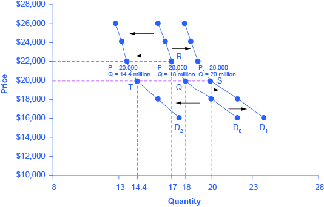
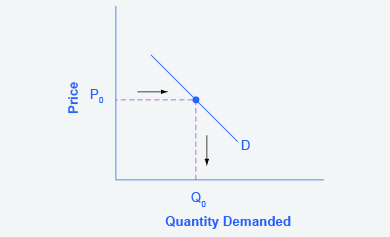
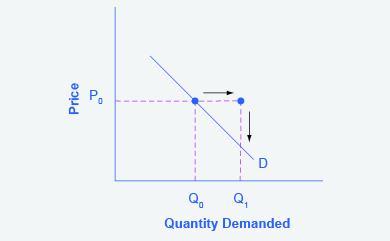
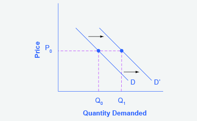
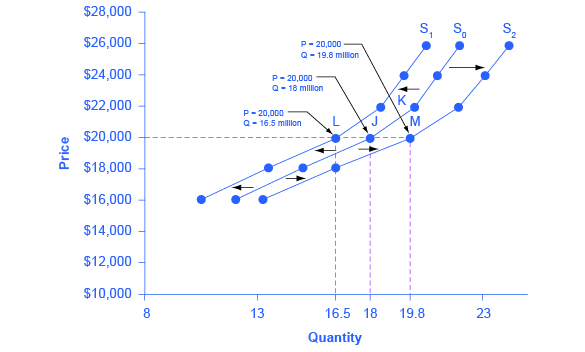
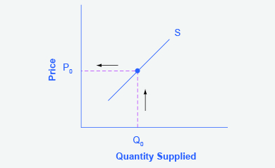
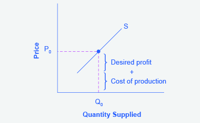
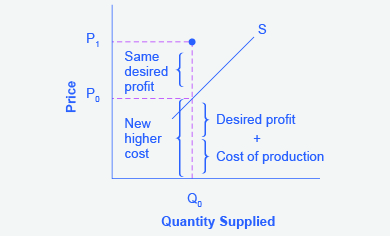
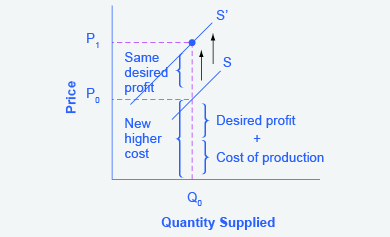

By the end of this section, you will be able to:

* Identify factors that affect demand
* Graph demand curves and demand shifts
* Identify factors that affect supply
* Graph supply curves and supply shifts

The previous module explored how **price**{: data-type="term" .no-emphasis} affects the quantity demanded and the quantity supplied. The result was the demand curve and the supply curve. Price, however, is not the only thing that influences demand. Nor is it the only thing that influences supply. For example, how is demand for vegetarian food affected if, say, health concerns cause more consumers to avoid eating meat? Or how is the supply of diamonds affected if diamond producers discover several new diamond mines? What are the major factors, in addition to the price, that influence demand or supply?

Visit this [website][1] to read a brief note on how marketing strategies can influence supply and demand of products.

  

# What Factors Affect Demand?

We defined demand as the amount of some product a consumer is willing and able to purchase at each price. That suggests at least two factors in addition to price that affect demand. Willingness to purchase suggests a desire, based on what economists call tastes and preferences. If you neither need nor want something, you will not buy it. Ability to purchase suggests that income is important. Professors are usually able to afford better housing and transportation than students, because they have more income. Prices of related goods can affect demand also. If you need a new car, the price of a Honda may affect your demand for a Ford. Finally, the size or composition of the population can affect demand. The more children a family has, the greater their demand for clothing. The more driving-age children a family has, the greater their demand for car insurance, and the less for diapers and baby formula.

These factors matter both for demand by an individual and demand by the market as a whole. Exactly how do these various factors affect demand, and how do we show the effects graphically? To answer those questions, we need the *ceteris paribus* assumption.

# The *Ceteris Paribus* Assumption

A **demand curve**{: data-type="term" .no-emphasis} or a **supply curve**{: data-type="term" .no-emphasis} is a relationship between two, and only two, variables: quantity on the horizontal axis and price on the vertical axis. The assumption behind a demand curve or a supply curve is that no relevant economic factors, other than the product’s price, are changing. Economists call this assumption **ceteris paribus**{: data-type="term"}, a Latin phrase meaning “other things being equal.” Any given demand or supply curve is based on the *ceteris paribus* assumption that all else is held equal. A demand curve or a supply curve is a relationship between two, and only two, variables when all other variables are kept constant. If all else is not held equal, then the laws of supply and demand will not necessarily hold, as the following Clear It Up feature shows.

When does *ceteris paribus* apply?

*Ceteris paribus* is typically applied when we look at how changes in price affect demand or supply, but *ceteris paribus* can be applied more generally. In the real world, demand and supply depend on more factors than just price. For example, a consumer’s demand depends on income and a producer’s supply depends on the cost of producing the product. How can we analyze the effect on demand or supply if multiple factors are changing at the same time—say price rises and income falls? The answer is that we examine the changes one at a time, assuming the other factors are held constant.

For example, we can say that an increase in the price reduces the amount consumers will buy (assuming income, and anything else that affects demand, is unchanged). Additionally, a decrease in income reduces the amount consumers can afford to buy (assuming price, and anything else that affects demand, is unchanged). This is what the *ceteris paribus* assumption really means. In this particular case, after we analyze each factor separately, we can combine the results. The amount consumers buy falls for two reasons: first because of the higher price and second because of the lower income.

# How Does Income Affect Demand?

Let’s use income as an example of how factors other than price affect demand. [\[link\]](#CNX_Econ_C03_004) shows the initial demand for automobiles as D0. At point Q, for example, if the price is $20,000 per car, the quantity of cars demanded is 18 million. D0 also shows how the quantity of cars demanded would change as a result of a higher or lower price. For example, if the price of a car rose to $22,000, the quantity demanded would decrease to 17 million, at point R.

The original demand curve D0, like every demand curve, is based on the *ceteris paribus* assumption that no other economically relevant factors change. Now imagine that the economy expands in a way that raises the incomes of many people, making cars more affordable. How will this affect demand? How can we show this graphically?

Return to [\[link\]](#CNX_Econ_C03_004). The price of cars is still $20,000, but with higher incomes, the quantity demanded has now increased to 20 million cars, shown at point S. As a result of the higher income levels, the demand curve shifts to the right to the new demand curve D1, indicating an increase in demand. [\[link\]](#Table_03_04) shows clearly that this increased demand would occur at every price, not just the original one.

 {: #CNX_Econ_C03_004 data-title="Shifts in Demand: A Car Example "}

<table id="Table_03_04" summary="The table is called &#x201C;Price and Demand Shifts: A Car Example.&#x201D; It has four columns that show how the demand for cars changes at different levels. The four columns are Price, Decrease to D2, Original Quantity Demanded D0, and Increase to D1. When a car is priced at $16,000, the Decrease to D2 is 17.6 million cars. The Original Quantity Demanded D0 is 22.0 million and the Increase to D1 is 24.0 million. When a car is $18,000, the Decrease to D2 is 16 million. The Original Quantity Demanded D0 is 20.0 million and the Increase to D1 is 22.0 million. At $20,000, the Decrease to D1 is 14.4 million cars. The Original Quantity Demanded D0 is 18.0 million and the Increase to D1 is 20.0 million. At $22,000, the Decrease to D1 is 13.6 million cars. The Original Quantity Demanded D0 is 17.0 million and the Increase to D1 is 19.0 million. At $24,000, the Decrease to D1 is 13.2 million cars. The Original Quantity Demanded D0 is 16.5 million and the Increase to D1 is 18.5 million. Finally, at $26,000, the Decrease to D1 is 12.8 million cars. The Original Quantity Demanded D0 is 16.0 million and the Increase to D1 is 18.0 million."><caption>Price and Demand Shifts: A Car Example</caption><thead>
<tr>
<th>Price</th>
<th>Decrease to D2</th>
<th>Original Quantity Demanded D0</th>
<th>Increase to D1</th>
</tr>
</thead><tbody>
<tr>
<td>$16,000</td>
<td>17.6 million</td>
<td>22.0 million</td>
<td>24.0 million</td>
</tr>

<tr>
<td>$18,000</td>
<td>16.0 million</td>
<td>20.0 million</td>
<td>22.0 million</td>
</tr>
<tr>
<td>$20,000</td>
<td>14.4 million</td>
<td>18.0 million</td>
<td>20.0 million</td>
</tr>
<tr>
<td>$22,000</td>
<td>13.6 million</td>
<td>17.0 million</td>
<td>19.0 million</td>
</tr>
<tr>
<td>$24,000</td>
<td>13.2 million</td>
<td>16.5 million</td>
<td>18.5 million</td>
</tr>
<tr>
<td>$26,000</td>
<td>12.8 million</td>
<td>16.0 million</td>
<td>18.0 million</td>
</tr>
</tbody></table>

Now, imagine that the economy slows down so that many people lose their jobs or work fewer hours, reducing their incomes. In this case, the decrease in income would lead to a lower quantity of cars demanded at every given price, and the original demand curve D0 would shift left to D2. The shift from D0 to D2 represents such a decrease in demand: At any given price level, the quantity demanded is now lower. In this example, a price of $20,000 means 18 million cars sold along the original demand curve, but only 14.4 million sold after demand fell.

When a demand curve shifts, it does not mean that the quantity demanded by every individual buyer changes by the same amount. In this example, not everyone would have higher or lower income and not everyone would buy or not buy an additional car. Instead, a shift in a demand curve captures an pattern for the market as a whole.

In the previous section, we argued that higher income causes greater demand at every price. This is true for most goods and services. For some—luxury cars, vacations in Europe, and fine jewelry—the effect of a rise in income can be especially pronounced. A product whose demand rises when income rises, and vice versa, is called a **normal good**{: data-type="term"}. A few exceptions to this pattern do exist. As incomes rise, many people will buy fewer generic brand groceries and more name brand groceries. They are less likely to buy used cars and more likely to buy new cars. They will be less likely to rent an apartment and more likely to own a home, and so on. A product whose demand falls when income rises, and vice versa, is called an **inferior good**{: data-type="term"}. In other words, when income increases, the demand curve shifts to the left.

# Other Factors That Shift Demand Curves

Income is not the only factor that causes a shift in demand. Other things that change demand include tastes and preferences, the composition or size of the population, the prices of related goods, and even expectations. A change in any one of the underlying factors that determine what quantity people are willing to buy at a given price will cause a shift in demand. Graphically, the new demand curve lies either to the right (an increase) or to the left (a decrease) of the original demand curve. Let’s look at these factors.

**Changing Tastes or Preferences**

From 1980 to 2014, the per-person consumption of chicken by Americans rose from 48 pounds per year to 85 pounds per year, and consumption of beef fell from 77 pounds per year to 54 pounds per year, according to the U.S. Department of Agriculture (USDA). Changes like these are largely due to movements in taste, which change the quantity of a good demanded at every price: that is, they shift the demand curve for that good, rightward for chicken and leftward for beef.

<strong>Changes in the Composition of the Population </strong>

The proportion of elderly citizens in the United States population is rising. It rose from 9.8% in 1970 to 12.6% in 2000, and will be a projected (by the **U.S. Census Bureau**{: data-type="term" .no-emphasis}) 20% of the population by 2030. A society with relatively more children, like the United States in the 1960s, will have greater demand for goods and services like tricycles and day care facilities. A society with relatively more elderly persons, as the United States is projected to have by 2030, has a higher demand for nursing homes and hearing aids. Similarly, changes in the size of the population can affect the demand for housing and many other goods. Each of these changes in demand will be shown as a shift in the demand curve.

The demand for a product can also be affected by changes in the prices of related goods such as substitutes or complements. A **substitute**{: data-type="term"} is a good or service that can be used in place of another good or service. As electronic books, like this one, become more available, you would expect to see a decrease in demand for traditional printed books. A lower price for a substitute decreases demand for the other product. For example, in recent years as the price of tablet computers has fallen, the quantity demanded has increased (because of the law of demand). Since people are purchasing tablets, there has been a decrease in demand for laptops, which can be shown graphically as a leftward shift in the demand curve for laptops. A higher price for a substitute good has the reverse effect.

Other goods are **complements**{: data-type="term"} for each other, meaning that the goods are often used together, because consumption of one good tends to enhance consumption of the other. Examples include breakfast cereal and milk; notebooks and pens or pencils, golf balls and golf clubs; gasoline and sport utility vehicles; and the five-way combination of bacon, lettuce, tomato, mayonnaise, and bread. If the price of golf clubs rises, since the quantity demanded of golf clubs falls (because of the law of demand), demand for a complement good like golf balls decreases, too. Similarly, a higher price for skis would shift the demand curve for a complement good like ski resort trips to the left, while a lower price for a complement has the reverse effect.

**Changes in Expectations about Future Prices or Other Factors that Affect Demand**

While it is clear that the price of a good affects the quantity demanded, it is also true that expectations about the future price (or expectations about tastes and preferences, income, and so on) can affect demand. For example, if people hear that a hurricane is coming, they may rush to the store to buy flashlight batteries and bottled water. If people learn that the price of a good like coffee is likely to rise in the future, they may head for the store to stock up on coffee now. These changes in demand are shown as shifts in the curve. Therefore, a **shift in demand**{: data-type="term"} happens when a change in some economic factor (other than price) causes a different quantity to be demanded at every price. The following Work It Out feature shows how this happens.

Shift in Demand

A shift in demand means that at any price (and at every price), the quantity demanded will be different than it was before. Following is an example of a shift in demand due to an income increase.

Step 1. Draw the graph of a demand curve for a normal good like pizza. Pick a price (like P0). Identify the corresponding Q0. An example is shown in [\[link\]](#CNX_Econ_C03_019).

{: #CNX_Econ_C03_019 data-title="Demand Curve "}

Step 2. Suppose income increases. As a result of the change, are consumers going to buy more or less pizza? The answer is more. Draw a dotted horizontal line from the chosen price, through the original quantity demanded, to the new point with the new Q1. Draw a dotted vertical line down to the horizontal axis and label the new Q1. An example is provided in [\[link\]](#CNX_Econ_C03_020).

{: #CNX_Econ_C03_020 data-title="Demand Curve with Income Increase "}

Step 3. Now, shift the curve through the new point. You will see that an increase in income causes an upward (or rightward) shift in the demand curve, so that at any price the quantities demanded will be higher, as shown in [\[link\]](#CNX_Econ_C03_021).

{: #CNX_Econ_C03_021 data-title="Demand Curve Shifted Right "}

# Summing Up Factors That Change Demand

Six factors that can shift demand curves are summarized in [\[link\]](#CNX_Econ_C03_026). The direction of the arrows indicates whether the demand curve shifts represent an increase in demand or a decrease in demand. Notice that a change in the price of the good or service itself is not listed among the factors that can shift a demand curve. A change in the price of a good or service causes a movement along a specific demand curve, and it typically leads to some change in the quantity demanded, but it does not shift the demand curve.

  A list of factors that can cause an increase in demand from D0 to D1. (b) The same factors, if their direction is reversed, can cause a decrease in demand from D0 to D1."){: #CNX_Econ_C03_026 data-title="Factors That Shift Demand Curves "}

When a demand curve shifts, it will then intersect with a given supply curve at a different equilibrium price and quantity. We are, however, getting ahead of our story. Before discussing how changes in demand can affect equilibrium price and quantity, we first need to discuss shifts in supply curves.

# How Production Costs Affect Supply

A supply curve shows how quantity supplied will change as the price rises and falls, assuming *ceteris paribus* so that no other economically relevant factors are changing. If other factors relevant to supply do change, then the entire supply curve will shift. Just as a shift in demand is represented by a change in the quantity demanded at every price, a **shift in supply**{: data-type="term"} means a change in the quantity supplied at every price.

In thinking about the factors that affect supply, remember what motivates firms: profits, which are the difference between revenues and costs. Goods and services are produced using combinations of labor, materials, and machinery, or what we call **inputs**{: data-type="term"} or **factors of production**{: data-type="term"}. If a firm faces lower costs of production, while the prices for the good or service the firm produces remain unchanged, a firm’s profits go up. When a firm’s profits increase, it is more motivated to produce output, since the more it produces the more profit it will earn. So, when costs of production fall, a firm will tend to supply a larger quantity at any given price for its output. This can be shown by the supply curve shifting to the right.

Take, for example, a messenger company that delivers packages around a city. The company may find that buying gasoline is one of its main costs. If the price of gasoline falls, then the company will find it can deliver messages more cheaply than before. Since lower costs correspond to higher profits, the messenger company may now supply more of its services at any given price. For example, given the lower gasoline prices, the company can now serve a greater area, and increase its supply.

Conversely, if a firm faces higher costs of production, then it will earn lower profits at any given selling price for its products. As a result, a higher cost of production typically causes a firm to supply a smaller quantity at any given price. In this case, the supply curve shifts to the left.

Consider the supply for cars, shown by curve S0 in [\[link\]](#CNX_Econ_C03_007). Point J indicates that if the price is $20,000, the quantity supplied will be 18 million cars. If the price rises to $22,000 per car, *ceteris paribus,* the quantity supplied will rise to 20 million cars, as point K on the S0 curve shows. The same information can be shown in table form, as in [\[link\]](#Table_03_05).

 {: #CNX_Econ_C03_007 data-title="Shifts in Supply: A Car Example "}

<table id="Table_03_05" summary="The table is called &#x201C;Price and Shifts in Supply: A Car Example.&#x201D; It has four columns that show how the supply of cars changes at different levels. The four columns are Price, Decrease to D1, Original Quantity Supplied S0, and Increase to S2. When a car is priced at $16,000, the Decrease to S1 is 10.5 million cars. The Original Quantity Supplied S0 is 12.0 million and the Increase to S2 is 13.2 million. When a car is $18,000, the Decrease to S1 is 13.5 million. The Original Quantity Supplied S0 is 15.0 million and the Increase to S2 is 16.5 million. At $20,000, the Decrease to S2 is 16.5 million cars. The Original Quantity Supplied S0 is 18.0 million and the Increase to S2 is 19.8 million. At $22,000, the Decrease to S1 is 18.5 million cars. The Original Quantity Supplied S0 is 20.0 million and the Increase to S2 is 22.0 million. At $24,000, the Decrease to S1 is 20.5 million cars. The Original Quantity Supplied S0 is 19.5 million and the Increase to S2 is 23.1 million. Finally, at $26,000, the Decrease to S1 is 20.5 million cars. The Original Quantity Supplied S0 is 22.0 million and the Increase to S2 is 24.2 million."><caption>Price and Shifts in Supply: A Car Example</caption><thead>
<tr>
<th>Price</th>
<th>Decrease to S1</th>
<th>Original Quantity Supplied S0</th>
<th>Increase to S2</th>
</tr>
</thead><tbody><tr>
<td>$16,000</td>
<td>10.5 million</td>
<td>12.0 million</td>
<td>13.2 million</td>
</tr>
<tr>
<td>$18,000</td>
<td>13.5 million</td>
<td>15.0 million</td>
<td>16.5 million</td>
</tr>
<tr>
<td>$20,000</td>
<td>16.5 million</td>
<td>18.0 million</td>
<td>19.8 million</td>
</tr>
<tr>
<td>$22,000</td>
<td>18.5 million</td>
<td>20.0 million</td>
<td>22.0 million</td>
</tr>
<tr>
<td>$24,000</td>
<td>19.5 million</td>
<td>21.0 million</td>
<td>23.1 million</td>
</tr>
<tr>
<td>$26,000</td>
<td>20.5 million</td>
<td>22.0 million</td>
<td>24.2 million</td>
</tr>
</tbody></table>

Now, imagine that the price of steel, an important ingredient in manufacturing cars, rises, so that producing a car has become more expensive. At any given price for selling cars, car manufacturers will react by supplying a lower quantity. This can be shown graphically as a leftward shift of supply, from S0 to S1, which indicates that at any given price, the quantity supplied decreases. In this example, at a price of $20,000, the quantity supplied decreases from 18 million on the original supply curve (S0) to 16.5 million on the supply curve S1, which is labeled as point L.

Conversely, if the price of steel decreases, producing a car becomes less expensive. At any given price for selling cars, car manufacturers can now expect to earn higher profits, so they will supply a higher quantity. The shift of supply to the right, from S0 to S2, means that at all prices, the quantity supplied has increased. In this example, at a price of $20,000, the quantity supplied increases from 18 million on the original supply curve (S0) to 19.8 million on the supply curve S2, which is labeled M.

# Other Factors That Affect Supply

In the example above, we saw that changes in the prices of inputs in the production process will affect the cost of production and thus the supply. Several other things affect the cost of production, too, such as changes in weather or other natural conditions, new technologies for production, and some government policies.

The cost of production for many agricultural products will be affected by changes in natural conditions. For example, in 2014 the Manchurian Plain in Northeastern China, which produces most of the country\'s wheat, corn, and soybeans, experienced its most severe drought in 50 years. A drought decreases the supply of agricultural products, which means that at any given price, a lower quantity will be supplied; conversely, especially good weather would shift the supply curve to the right.

When a **firm**{: data-type="term" .no-emphasis} discovers a new technology that allows the firm to produce at a lower cost, the supply curve will shift to the right, as well. For instance, in the 1960s a major scientific effort nicknamed the Green Revolution focused on breeding improved seeds for basic crops like wheat and rice. By the early 1990s, more than two-thirds of the wheat and rice in low-income countries around the world was grown with these Green Revolution seeds—and the harvest was twice as high per acre. A technological improvement that reduces costs of production will shift supply to the right, so that a greater quantity will be produced at any given price.

Government policies can affect the cost of production and the supply curve through taxes, regulations, and subsidies. For example, the U.S. government imposes a tax on alcoholic beverages that collects about $8 billion per year from producers. Taxes are treated as costs by businesses. Higher costs decrease supply for the reasons discussed above. Other examples of policy that can affect cost are the wide array of government regulations that require firms to spend money to provide a cleaner environment or a safer workplace; complying with regulations increases costs.

A government subsidy, on the other hand, is the opposite of a tax. A subsidy occurs when the government pays a firm directly or reduces the firm’s taxes if the firm carries out certain actions. From the firm’s perspective, taxes or regulations are an additional cost of production that shifts supply to the left, leading the firm to produce a lower quantity at every given price. Government subsidies reduce the cost of production and increase supply at every given price, shifting supply to the right. The following Work It Out feature shows how this shift happens.

Shift in Supply

We know that a supply curve shows the minimum price a firm will accept to produce a given quantity of output. What happens to the supply curve when the cost of production goes up? Following is an example of a shift in supply due to a production cost increase.

Step 1. Draw a graph of a supply curve for pizza. Pick a quantity (like Q0). If you draw a vertical line up from Q0 to the supply curve, you will see the price the firm chooses. An example is shown in [\[link\]](#CNX_Econ_C03_022).

{: #CNX_Econ_C03_022 data-title="Suppy Curve "}

Step 2. Why did the firm choose that price and not some other? One way to think about this is that the price is composed of two parts. The first part is the average cost of production, in this case, the cost of the pizza ingredients (dough, sauce, cheese, pepperoni, and so on), the cost of the pizza oven, the rent on the shop, and the wages of the workers. The second part is the firm’s desired profit, which is determined, among other factors, by the profit margins in that particular business. If you add these two parts together, you get the price the firm wishes to charge. The quantity Q0 and associated price P0 give you one point on the firm’s supply curve, as shown in [\[link\]](#CNX_Econ_C03_023).

{: #CNX_Econ_C03_023 data-title="Setting Prices "}

Step 3. Now, suppose that the cost of production goes up. Perhaps cheese has become more expensive by $0.75 per pizza. If that is true, the firm will want to raise its price by the amount of the increase in cost ($0.75). Draw this point on the supply curve directly above the initial point on the curve, but $0.75 higher, as shown in [\[link\]](#CNX_Econ_C03_024).

{: #CNX_Econ_C03_024 data-title="Increasing Costs Leads to Increasing Price "}

Step 4. Shift the supply curve through this point. You will see that an increase in cost causes an upward (or a leftward) shift of the supply curve so that at any price, the quantities supplied will be smaller, as shown in [\[link\]](#CNX_Econ_C03_025).

{: #CNX_Econ_C03_025 data-title="Supply Curve Shifts "}

# Summing Up Factors That Change Supply

Changes in the cost of inputs, natural disasters, new technologies, and the impact of government decisions all affect the cost of production. In turn, these factors affect how much firms are willing to supply at any given price.

[\[link\]](#CNX_Econ_C03_027) summarizes factors that change the supply of goods and services. Notice that a change in the price of the product itself is not among the factors that shift the supply curve. Although a change in price of a good or service typically causes a change in quantity supplied or a movement along the supply curve for that specific good or service, it does not cause the supply curve itself to shift.

 A list of factors that can cause an increase in supply from S0 to S1. (b) The same factors, if their direction is reversed, can cause a decrease in supply from S0 to S1.&#10;"){: #CNX_Econ_C03_027 data-title="Factors That Shift Supply Curves "}

Because demand and supply curves appear on a two-dimensional diagram with only price and quantity on the axes, an unwary visitor to the land of economics might be fooled into believing that economics is about only four topics: demand, supply, price, and quantity. However, demand and supply are really “umbrella” concepts: demand covers all the factors that affect demand, and supply covers all the factors that affect supply. Factors other than price that affect demand and supply are included by using shifts in the demand or the supply curve. In this way, the two-dimensional demand and supply model becomes a powerful tool for analyzing a wide range of economic circumstances.

# Key Concepts and Summary

Economists often use the *ceteris paribus* or “other things being equal” assumption: while examining the economic impact of one event, all other factors remain unchanged for the purpose of the analysis. Factors that can shift the demand curve for goods and services, causing a different quantity to be demanded at any given price, include changes in tastes, population, income, prices of substitute or complement goods, and expectations about future conditions and prices. Factors that can shift the supply curve for goods and services, causing a different quantity to be supplied at any given price, include input prices, natural conditions, changes in technology, and government taxes, regulations, or subsidies.

# Self-Check Questions

Why do economists use the *ceteris paribus* assumption?

To make it easier to analyze complex problems. *Ceteris paribus* allows you to look at the effect of one factor at a time on what it is you are trying to analyze. When you have analyzed all the factors individually, you add the results together to get the final answer.

In an analysis of the market for paint, an economist discovers the facts listed below. State whether each of these changes will affect supply or demand, and in what direction.  There have recently been some important cost-saving inventions in the technology for making paint. Paint is lasting longer, so that property owners need not repaint as often. Because of severe hailstorms, many people need to repaint now. The hailstorms damaged several factories that make paint, forcing them to close down for several months. 

1.  An improvement in technology that reduces the cost of production will cause an increase in supply. Alternatively, you can think of this as a reduction in price necessary for firms to supply any quantity. Either way, this can be shown as a rightward (or downward) shift in the supply curve.
2.  An improvement in product quality is treated as an increase in tastes or preferences, meaning consumers demand more paint at any price level, so demand increases or shifts to the right. If this seems counterintuitive, note that demand in the future for the longer-lasting paint will fall, since consumers are essentially shifting demand from the future to the present.
3.  An increase in need causes an increase in demand or a rightward shift in the demand curve.
4.  Factory damage means that firms are unable to supply as much in the present. Technically, this is an increase in the cost of production. Either way you look at it, the supply curve shifts to the left.
{: data-number-style="lower-alpha"}

Many changes are affecting the market for oil. Predict how each of the following events will affect the equilibrium price and quantity in the market for oil. In each case, state how the event will affect the supply and demand diagram. Create a sketch of the diagram if necessary.  Cars are becoming more fuel efficient, and therefore get more miles to the gallon. The winter is exceptionally cold. A major discovery of new oil is made off the coast of Norway. The economies of some major oil-using nations, like Japan, slow down. A war in the Middle East disrupts oil-pumping schedules. Landlords install additional insulation in buildings. The price of solar energy falls dramatically. Chemical companies invent a new, popular kind of plastic made from oil. 

1.  More fuel-efficient cars means there is less need for gasoline. This causes a leftward shift in the demand for gasoline and thus oil. Since the demand curve is shifting down the supply curve, the equilibrium price and quantity both fall.
2.  Cold weather increases the need for heating oil. This causes a rightward shift in the demand for heating oil and thus oil. Since the demand curve is shifting up the supply curve, the equilibrium price and quantity both rise.
3.  A discovery of new oil will make oil more abundant. This can be shown as a rightward shift in the supply curve, which will cause a decrease in the equilibrium price along with an increase in the equilibrium quantity. (The supply curve shifts down the demand curve so price and quantity follow the law of demand. If price goes down, then the quantity goes up.)
4.  When an economy slows down, it produces less output and demands less input, including energy, which is used in the production of virtually everything. A decrease in demand for energy will be reflected as a decrease in the demand for oil, or a leftward shift in demand for oil. Since the demand curve is shifting down the supply curve, both the equilibrium price and quantity of oil will fall.
5.  Disruption of oil pumping will reduce the supply of oil. This leftward shift in the supply curve will show a movement up the demand curve, resulting in an increase in the equilibrium price of oil and a decrease in the equilibrium quantity.
6.  Increased insulation will decrease the demand for heating. This leftward shift in the demand for oil causes a movement down the supply curve, resulting in a decrease in the equilibrium price and quantity of oil.
7.  Solar energy is a substitute for oil-based energy. So if solar energy becomes cheaper, the demand for oil will decrease as consumers switch from oil to solar. The decrease in demand for oil will be shown as a leftward shift in the demand curve. As the demand curve shifts down the supply curve, both equilibrium price and quantity for oil will fall.
8.  A new, popular kind of plastic will increase the demand for oil. The increase in demand will be shown as a rightward shift in demand, raising the equilibrium price and quantity of oil.
{: data-number-style="lower-alpha"}

# Review Questions

When analyzing a market, how do economists deal with the problem that many factors that affect the market are changing at the same time?

Name some factors that can cause a shift in the demand curve in markets for goods and services.

Name some factors that can cause a shift in the supply curve in markets for goods and services.

# Critical Thinking Questions

Consider the demand for hamburgers. If the price of a substitute good (for example, hot dogs) increases and the price of a complement good (for example, hamburger buns) increases, can you tell for sure what will happen to the demand for hamburgers? Why or why not? Illustrate your answer with a graph.

How do you suppose the demographics of an aging population of “Baby Boomers” in the United States will affect the demand for milk? Justify your answer.

We know that a change in the price of a product causes a movement along the demand curve. Suppose consumers believe that prices will be rising in the future. How will that affect demand for the product in the present? Can you show this graphically?

Suppose there is soda tax to curb obesity. What should a reduction in the soda tax do to the supply of sodas and to the equilibrium price and quantity? Can you show this graphically? *Hint*: assume that the soda tax is collected from the sellers

# Problems

[[link]](#Table_03_06) shows information on the demand and supply for bicycles, where the quantities of bicycles are measured in thousands.

<table id="Table_03_06" summary="The table shows information on the demand and supply for bicycles, where the quantities of bicycles are measured in thousands. At $120 per bicycle, the quantity demanded is 50,000 and the quantity supplied is 36,000. At $150, the quantity demanded is 40,000 and the quantity supplied is 40,000. At $180, the quantity demanded is 32,000 and the quantity supplied is 48,000. At $210, the quantity demanded is 28,000 and the quantity supplied is 56,000. Finally, at $240, the quantity demanded is 24,000 and the quantity supplied is 70,000."><caption /><thead>
<tr>
<th>Price</th>
<th>Qd</th>
<th>Qs</th>
</tr>
</thead><tbody>
<tr>
<td>$120</td>
<td>50</td>
<td>36</td>
</tr>
<tr>
<td>$150</td>
<td>40</td>
<td>40</td>
</tr>
<tr>
<td>$180</td>
<td>32</td>
<td>48</td>
</tr>
<tr>
<td>$210</td>
<td>28</td>
<td>56</td>
</tr>
<tr>
<td>$240</td>
<td>24</td>
<td>70</td>
</tr>
</tbody></table>
1.  What is the quantity demanded and the quantity supplied at a price of $210?
2.  At what price is the quantity supplied equal to 48,000?
3.  Graph the demand and supply curve for bicycles. How can you determine the equilibrium price and quantity from the graph? How can you determine the equilibrium price and quantity from the table? What are the equilibrium price and equilibrium quantity?
4.  If the price was $120, what would the quantities demanded and supplied be? Would a shortage or surplus exist? If so, how large would the shortage or surplus be?
{: data-number-style="lower-alpha"}

The computer market in recent years has seen many more computers sell at much lower prices. What shift in demand or supply is most likely to explain this outcome? Sketch a demand and supply diagram and explain your reasoning for each.  A rise in demand A fall in demand A rise in supply A fall in supply 

# References

Landsburg, Steven E. *The Armchair Economist: Economics and Everyday Life*. New York: The Free Press. 2012. specifically Section IV: How Markets Work.

National Chicken Council. 2015. \"Per Capita Consumption of Poultry and Livestock, 1965 to Estimated 2015, in Pounds.\" Accessed April 13, 2015. http://www.nationalchickencouncil.org/about-the-industry/statistics/per-capita-consumption-of-poultry-and-livestock-1965-to-estimated-2012-in-pounds/.

Wessel, David. “Saudi Arabia Fears $40-a-Barrel Oil, Too.” *The Wall Street Journal*. May 27, 2004, p. 42. http://online.wsj.com/news/articles/SB108561000087822300.

[1]: http://openstaxcollege.org/l/toothfish
