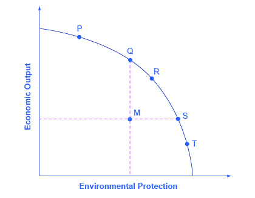
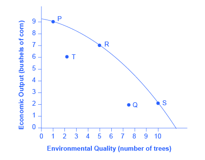

By the end of this section, you will be able to:

* Apply the production possibility frontier to evaluate the tradeoff between economic output and the environment
* Interpret a graphic representation of the tradeoff between economic output and environmental protection

The tradeoff between economic output and the environment can be analyzed with a **production possibility frontier (PPF)**{: data-type="term" .no-emphasis} such as the one shown in [\[link\]](#CNX_Econ_C12_004). At one extreme, at a choice like P, a country would be selecting a high level of economic output but very little environmental protection. At the other extreme, at a choice like T, a country would be selecting a high level of environmental protection but little economic output. According to the graph, an increase in environmental protection involves an opportunity cost of less economic output. No matter what their preferences, all societies should wish to avoid choices like M, which are productively inefficient. Efficiency requires that the choice should be on the production possibility frontier.

{: #CNX_Econ_C12_004 data-title="The Tradeoff between Economic Output and Environmental Protection "}

Economists do not have a great deal to say about the choice between P, Q, R, S and T in [\[link\]](#CNX_Econ_C12_004), all of which lie along the production possibility frontier. Countries with low per capita **gross domestic product (GDP)**{: data-type="term" .no-emphasis}, such as China, place a greater emphasis on economic output—which in turn helps to produce nutrition, shelter, health, education, and desirable consumer goods. Countries with higher income levels, where a greater share of people have access to the basic necessities of life, may be willing to place a relatively greater emphasis on environmental protection.

However, economists are united in their belief that an inefficient choice such as M is undesirable. Rather than choosing M, a nation could achieve either greater economic output with the same environmental protection, as at point Q, or greater environmental protection with the same level of output, as at point S. The problem with command-and-control environmental laws is that they sometimes involve a choice like M. Market-oriented environmental tools offer a mechanism either for providing either the same environmental protection at lower cost, or providing a greater degree of environmental protection for the same cost.

Keystone XL

So how would an economist respond to claims of environmental damage caused by the Keystone XL project? Clearly the environmental cost of oil spills would be considered a negative externality, but how many external costs would arise? And are these costs “too high” when measured against any potential for economic benefit?

As this chapter indicates, in deciding whether construction of the pipeline is a good idea, an economist would want to know not only about the marginal benefits resulting from the additional pipeline construction, but also the potential marginal costs—and especially the marginal external costs of the pipeline. Typically these come in the form of environmental impact statements, which are usually required for these kinds of projects. The most recent impact statement, released in March 2013 by the Nebraska Department of State, considered the possibility of fewer miles of pipeline going over the aquifer system and avoiding completely environmentally fragile areas; it indicated that “most resources” would not be harmed by construction of the pipeline.

As of press time, the Obama Administration has not approved construction of the Keystone XL project. While the economic benefits of additional oil in the United States may be fairly easily quantified, the social costs are not. It seems that, in a period of economic expansion, people want to err on the side of caution and estimate the marginal costs to be greater than the marginal benefits of additional oil generation. Those estimates may change, however, if the price of gasoline continues to rise.

### Key Concepts and Summary

Depending on their different income levels and political preferences, countries are likely to make different choices about **allocative efficiency**{: data-type="term" .no-emphasis}—that is, the choice between economic output and environmental protection along the production possibility frontier. However, all countries should prefer to make a choice that shows **productive efficiency**{: data-type="term" .no-emphasis}—that is, the choice is somewhere on the production possibility frontier rather than inside it. Revisit [Choice in a World of Scarcity](/m48602){: .target-chapter} for more on these terms.

### Self-Check Questions

A country called Sherwood is very heavily covered with a forest of 50,000 trees. There are proposals to clear some of Sherwood’s forest and grow corn, but obtaining this additional economic output will have an environmental cost from reducing the number of trees. [[link]](#Table_12_17) shows possible combinations of economic output and environmental protection.

<table id="Table_12_17" summary="Table has 3 columns and 5 rows of data. The header row is Column 1 Combos, Column 2 Corn bushels (thousands), and column 3 Number of Trees (thousands). The data is Row 1: P, 9, 5. Row 2: Q, 2, 30. Row 3: R, 7, 20. Row 4: S, 2, 40. Row 5: T, 6, 10"><caption /><thead>
<tr>
<th><em>Combos</em></th>
<th>Corn Bushels (thousands)</th>
<th>Number of Trees (thousands)</th>
</tr>
</thead><tbody>
<tr>
<td><strong>P</strong></td>
<td>9</td>
<td>5</td>
</tr>
<tr>
<td><strong>Q</strong></td>
<td>2</td>
<td>30</td>
</tr>
<tr>
<td><strong>R</strong></td>
<td>7</td>
<td>20</td>
</tr>
<tr>
<td><strong>S</strong></td>
<td>2</td>
<td>40</td>
</tr>
<tr>
<td><strong>T</strong></td>
<td>6</td>
<td>10</td>
</tr>
</tbody></table>
1.  Sketch a graph of a production possibility frontier with environmental quality on the horizontal axis, measured by the number of trees, and the quantity of economic output, measured in corn, on the vertical axis.
2.  Which choices display productive efficiency? How can you tell?
3.  Which choices show allocative efficiency? How can you tell?
4.  In the choice between T and R, decide which one is better. Why?
5.  In the choice between T and S, can you say which one is better, and why?
6.  If you had to guess, which choice would you think is more likely to represent a command-and-control environmental policy and which choice is more likely to represent a market-oriented environmental policy, choice Q or S? Why?
{: data-number-style="lower-alpha"}

1.  {: #CNX_Econ_C12_005}

2.  Of the choices provided, P, R, and S demonstrate productive efficiency. These are the choices on the production possibility frontier.
3.  Allocative efficiency is determined by the preferences—in this case by the preferences of society as expressed through government and other social institutions. Because you do not have information about these preferences, you really cannot say much about allocative efficiency.
4.  In the choice between T and R, R should clearly be preferred, because it has both more corn and more trees. This answer illustrates why productive efficiency is beneficial. Compared with choices inside the PPF, it means more of one or both goods.
5.  In the choice between T and S, it is not possible to say which choice is better. True, S is on the PPF and T is not—but that only addresses the issue of productive efficiency. If a society has a strong preference for economic output and places a lower value on trees, then allocative efficiency may lead to a choice of T over S. Of course, the reverse could also be true, leading to a choice of S. Without information on society’s preferences to judge allocative efficiency, this question cannot be answered.
6.  Compared with command-and-control policies, market-oriented policies allow either more output with the same environmental protection or more environmental protection with the same level of output—or more of both environmental protection and output. Thus, a choice like Q inside the PPF is more likely to represent a command-and-control policy demand than a choice like S on the frontier of the PPF.
{: data-number-style="lower-alpha"}

### Review Questions

In the tradeoff between economic output and environmental protection, what do the combinations on the protection possibility curve represent?

What does a point inside the production possibility frontier represent?

### Critical Thinking Questions

Technological innovations shift the production possibility curve. Look at graph you sketched for [[link]](#fs-idm84125904) Which types of technologies should a country promote? Should “clean” technologies be promoted over other technologies? Why or why not?

### Problems

In the Land of Purity, there is only one form of pollution, called “gunk.” [[link]](#Table_12_18) shows possible combinations of economic output and reduction of gunk, depending on what kinds of environmental regulations are chosen.

<table id="Table_12_18" summary="The table had 3 columns and 5 rows of data. The header row is column 1 combos, column 2 Eco Output and Column 3 Gunk cleaned up. The data is Row 1: J, 800, 10% Row 2: K, 500, 30%. Row 3: L, 600, 40%. Row 4 M, 400, 40%. Row 5 N, 100, 90%"><caption /><thead>
<tr>
<th><em>Combos</em></th>
<th>Eco Output</th>
<th>Gunk Cleaned Up</th>
</tr>
</thead><tbody>
<tr>
<td><strong>J</strong></td>
<td>800</td>
<td>10%</td>
</tr>
<tr>
<td><strong>K</strong></td>
<td>500</td>
<td>30%</td>
</tr>
<tr>
<td><strong>L</strong></td>
<td>600</td>
<td>40%</td>
</tr>
<tr>
<td><strong>M</strong></td>
<td>400</td>
<td>40%</td>
</tr>
<tr>
<td><strong>N</strong></td>
<td>100</td>
<td>90%</td>
</tr>
</tbody></table>
1.  Sketch a graph of a production possibility frontier with environmental quality on the horizontal axis, measured by the percentage reduction of gunk, and with the quantity of economic output on the vertical axis.
2.  Which choices display productive efficiency? How can you tell?
3.  Which choices show allocative efficiency? How can you tell?
4.  In the choice between K and L, can you say which one is better and why?
5.  In the choice between K and N, can you say which one is better, and why?
6.  If you had to guess, which choice would you think is more likely to represent a command-and-control environmental policy and which choice is more likely to represent a market-oriented environmental policy, choice L or M? Why?
{: data-number-style="lower-alpha"}

