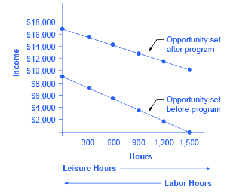

By the end of this section, you will be able to:
* Explain the poverty trap, noting how it is impacted by government programs
* Identify potential issues in government programs that seek to reduce poverty
* Calculate a budget constraint line that represents the poverty trap

Can you give people too much help, or the wrong kind of help? When people are provided with food, shelter, healthcare, income, and other necessities, assistance may reduce their incentive to work. Consider a program to fight poverty that works in this reasonable-sounding manner: the government provides assistance to the poor, but as the poor earn income to support themselves, the government reduces the level of assistance it provides. With such a program, every time a poor person earns $100, the person loses $100 in government support. As a result, the person experiences no net gain for working. Economists call this problem the **poverty trap**{: data-type="term"}.

Consider the situation faced by a single-parent family. A single mother (earning $8 an hour) with two children, as illustrated in [\[link\]](#CNX_Econ_C14_002). First, consider the **labor-leisure budget constraint**{: data-type="term" .no-emphasis} faced by this family in a situation without government assistance. On the horizontal axis is hours of leisure (or time spent with family responsibilities) increasing in quantity from right to left. Also on the horizontal axis is the number of hours at paid work, going from zero hours on the right to the maximum of 2,500 hours on the left. On the vertical axis is the amount of income per year rising from low to higher amounts of income. The budget constraint line shows that at zero hours of leisure and 2,500 hours of work, the maximum amount of income is $20,000 ($8 × 2,500 hours). At the other extreme of the budget constraint line, an individual would work zero hours, earn zero income, but enjoy 2,500 hours of leisure. At point A on the **budget constraint line**{: data-type="term" .no-emphasis}, by working 40 hours a week, 50 weeks a year, the utility-maximizing choice is to work a total of 2,000 hours per year and earn $16,000.

Now suppose that a government antipoverty program guarantees every family with a single mother and two children $18,000 in income. This is represented on the graph by a horizontal line at $18,000. With this program, each time the mother earns $1,000, the government will deduct $1,000 of its support. [\[link\]](#ch14mod02_tab03) shows what will happen at each combination of work and government support.

{: #CNX_Econ_C14_002 data-title="The Poverty Trap in Action"}

<table id="ch14mod02_tab03" summary="The table shows an individual&#x2019;s total income at various combinations of work and support. Column 1 lists the amount of hours worked. Column 2 lists the total earnings for the hours worked. Column 3 lists the dollar amount of government support received. Column 4 lists the total income. 0 hours worked; 0 total earnings; $18,000 government support; $18,000 total income. 500 hours worked; $4,000 total earnings; $14,000 government support; $18,000 total earnings. 1,000 hours worked; $8,000 total earnings; $10,000 government support; $18,000 total income. 1,500 hours worked; $12,000 total earning; $6,000 government support; $18,000 total income. 2,000 hours worked; $16,000 total earnings; $2,000 government support; $18,000 total income. 2,500 hours worked; $20,000 total earnings; 0 government support; $20,000 total income."><caption>Total Income at Various Combinations of Work and Support</caption><thead>
<tr>
<th>Amount Worked (hours)</th>
<th>Total Earnings</th>
<th>Government Support</th>
<th>Total Income</th>
</tr>
</thead><tbody>
<tr>
<td>0</td>
<td>0</td>
<td>$18,000</td>
<td>$18,000</td>
</tr>
<tr>
<td>500</td>
<td>$4,000</td>
<td>$14,000</td>
<td>$18,000</td>
</tr>
<tr>
<td>1,000</td>
<td>$8,000</td>
<td>$10,000</td>
<td>$18,000</td>
</tr>
<tr>
<td>1,500</td>
<td>$12,000</td>
<td>$6,000</td>
<td>$18,000</td>
</tr>
<tr>
<td>2,000</td>
<td>$16,000</td>
<td>$2,000</td>
<td>$18,000</td>
</tr>
<tr>
<td>2,500</td>
<td>$20,000</td>
<td>0</td>
<td>$20,000</td>
</tr>
</tbody></table>

The new budget line, with the antipoverty program in place, is the horizontal and heavy line that is flat at $18,000. If the mother does not work at all, she receives $18,000, all from the government. If she works full time, giving up 40 hours per week with her children, she still ends up with $18,000 at the end of the year. Only if she works 2,300 hours in the year—which is an average of 44 hours per week for 50 weeks a year—does household income rise to $18,400. Even in this case, all of her year’s work means that household income rises by only $400 over the income she would receive if she did not work at all. She would need to work 50 hours a week to reach $20,000.

Indeed, the poverty trap is even stronger than this simplified example shows, because a working mother will have extra expenses like clothing, transportation, and child care that a nonworking mother will not face, making the economic gains from working even smaller. Moreover, those who do not work fail to build up job experience and contacts, which makes working in the future even less likely.

The bite of the poverty trap can be reduced by designing an antipoverty program so that, instead of reducing government payments by $1 for every $1 earned, payments are reduced by some smaller amount instead. The bite of the poverty trap can also be reduced by imposing requirements for work as a condition of receiving benefits and setting a time limit on benefits.

[\[link\]](#CNX_Econ_C14_003) illustrates a government program that guarantees $18,000 in income, even for those who do not work at all, but then reduces this amount by 50 cents for each $1 earned. The new, higher budget line in [\[link\]](#CNX_Econ_C14_003) shows that, with this program, additional hours of work will bring some economic gain. Because of the reduction in government income when an individual works, an individual earning $8.00 will really net only $4.00 per hour. The vertical intercept of this higher budget constraint line is at $28,000 ($18,000 + 2,500 hours × $4.00 = $28,000). The horizontal intercept is at the point on the graph where $18,000 and 2500 hours of leisure is set. [\[link\]](#ch14mod02_tab04) shows the total income differences with various choices of labor and leisure.

However, this type of program raises other issues. First, even if it does not eliminate the incentive to work by reducing government payments by $1 for every $1 earned, enacting such a program may still reduce the incentive to work. At least some people who would be working 2,000 hours each year without this program might decide to work fewer hours but still end up with more income—that is, their choice on the new budget line would be like S, above and to the right of the original choice P. Of course, others may choose a point like R, which involves the same amount of work as P, or even a point to the left of R that involves more work.

The second major issue is that when the government phases out its support payments more slowly, the antipoverty program costs more money. Still, it may be preferable in the long run to spend more money on a program that retains a greater incentive to work, rather than spending less money on a program that nearly eliminates any gains from working.

 ![The graph shows a downward sloping line that extends from $28,000 on the y-axis to $18,000 on the y-axis (from 0 to 2,500 on the x-axis). Two points R and S appear on the line. Another line starts at (0, $20,000) and ends at (2,500, 0). A dashed plum line extends horizontally from $18,000 on the y-axis and meets with the vertical line extending from 2,500 on the x-axis. Another dashed plum line extends from $16,000 on the y-axis and intersects with the vertical line extending from 500 on the x-axis at point P. Beneath the x-axis is an arrow pointing to the right indicating leisure (hours) and an arrow pointing to the left indicating labor (hours).](../resources/CNX_Econ_C14_003.jpg "On the original labor-leisure opportunity set, the lower budget set shown by the smaller dashed line in the figure, the preferred choice P is 500 hours of leisure and $16,000 of income. Then, the government created an antipoverty program that guarantees $18,000 in income even to those who work zero hours, shown by the larger dashed line. In addition, every $1 earned means phasing out 50 cents of benefits. This program leads to the higher budget set shown in the diagram. The hope is that this program will provide incentives to work the same or more hours, despite receiving income assistance. However, it is possible that the recipients will choose a point on the new budget set like S, with less work, more leisure, and greater income, or a point like R, with the same work and greater income."){: #CNX_Econ_C14_003 data-title="Loosening the Poverty Trap: Reducing Government Assistance by 50 Cents for Every $1 Earned"}

<table id="ch14mod02_tab04" summary="The table shows the total income differences with various choices of labor and leisure; government assistance is reduced by 50 cents for every dollar earned. Column 1 lists the amount of hours worked. Column 2 lists the total earnings for the hours worked. Column 3 lists the dollar amount of government support received. Column 4 lists the total income. 0 hours worked; 0 total earnings; $18,000 government support; $18,000 total income. 500 hours worked; $4,000 total earnings; $16,000 government support; $20,000 total earnings. 1,000 hours worked; $8,000 total earnings; $14,000 government support; $22,000 total income. 1,500 hours worked; $12,000 total earning; $12,000 government support; $24,000 total income. 2,000 hours worked; $16,000 total earnings; $10,000 government support; $26,000 total income. 2,500 hours worked; $20,000 total earnings; $8,000 government support; $28,000 total income."><caption>The Labor-Leisure Tradeoff with Assistance Reduced by 50 Cents for Every Dollar Earned</caption><thead>
<tr>
<th>Amount Worked (hours)</th>
<th>Total Earnings</th>
<th>Government Support</th>
<th>Total Income</th>
</tr>
</thead><tbody>
<tr>
<td>0</td>
<td>0</td>
<td>$18,000</td>
<td>$18,000</td>
</tr>
<tr>
<td>500</td>
<td>$4,000</td>
<td>$16,000</td>
<td>$20,000</td>
</tr>
<tr>
<td>1,000</td>
<td>$8,000</td>
<td>$14,000</td>
<td>$22,000</td>
</tr>
<tr>
<td>1,500</td>
<td>$12,000</td>
<td>$12,000</td>
<td>$24,000</td>
</tr>
<tr>
<td>2,000</td>
<td>$16,000</td>
<td>$10,000</td>
<td>$26,000</td>
</tr>
<tr>
<td>2,500</td>
<td>$20,000</td>
<td>$8,000</td>
<td>$28,000</td>
</tr>
</tbody></table>

The next module will consider a variety of government support programs focused specifically on the poor, including welfare, SNAP (food supplement), Medicaid, and the earned income tax credit (EITC). Although these programs vary from state to state, it is generally a true statement that in many states from the 1960s into the 1980s, if poor people worked, their level of income barely rose—or did not rise at all—after the reduction in government support payments was factored in. The following Work It Out feature shows how this happens.

Calculating a Budget Constraint Line

Jason earns $9.00 an hour, and a government antipoverty program provides a floor of $10,000 guaranteed income. The government reduces government support by $0.50 for each $1.00 earned. What are the horizontal and vertical intercepts of the budget constraint line? Assume the maximum hours for work or leisure is 2,500 hours.

Step 1. Determine the amount of the government guaranteed income. In this case, it is $10,000.

Step 2. Plot that guaranteed income as a horizontal line on the budget constraint line.

Step 3. Determine what Jason earns if he has no income and enjoys 2,500 hours of leisure. In this case, he will receive the guaranteed $10,000 (the horizontal intercept).

Step 4. Calculate how much Jason’s salary will be reduced by due to the reduction in government income. In Jason’s case, it will be reduced by one half. He will, in effect, net only $4.50 an hour.

Step 5. If Jason works 1,000 hours, at a maximum what income will Jason receive? Jason will get the government assistance of $10,000. He will net only $4.50 for every hour he chooses to work. If he works 1,000 hours at $4.50, his earned income is $4,500 plus the government income of $10,000. Thus the total maximum income (the vertical intercept) is $10,000 + $4,500 = $14,500.

# Key Concepts and Summary   {#ch14mod02_summ}

A poverty trap occurs when government-support payments for the poor decline as the poor earn more income. As a result, the poor do not end up with much more income when they work, because the loss of government support largely or completely offsets any income that is earned by working. The bite of the poverty trap can be reduced by phasing out government benefits more slowly, as well as by imposing requirements for work as a condition of receiving benefits and a time limit on benefits.

# Self-Check Questions   {#ch14mod02_sques}

Jonathon is a single father with one child. He can work as a server for $6 per hour for up to 1,500 hours per year. He is eligible for welfare, and so if he does not earn any income, he will receive a total of $10,000 per year. He can work and still receive government benefits, but for every $1 of income, his welfare stipend is $1 less. Create a table similar to [[link]](#ch14mod02_tab04) that shows Jonathan’s options. Use four columns, the first showing number of hours to work, the second showing his earnings from work, the third showing the government benefits he will receive, and the fourth column showing his total income (earnings + government support). Sketch a labor-leisure diagram of Jonathan’s opportunity set with and without government support.

Jonathon’s options for working and total income are shown in the following table. His labor-leisure diagram is shown in the figure following the table. | Number of Work Hours | Earnings from Work | Government Benefits | Total Income |
|----------
| 1,500 | $9,000 | $1,000 | $10,000 |
| 1,200 | $7,200 | $2,800 | $10,000 |
| 900 | $5,400 | $4,600 | $10,000 |
| 600 | $3,600 | $6,400 | $10,000 |
| 300 | $1,800 | $8,200 | $10,000 |
| 0 | $0 | $10,000 | $10,000 |
{: #ch14mod02_tab05 summary="The table shows Jonathon&#x2019;s options for working and what his total income would be for each option. Column 1 lists the number of hours worked. Column 2 lists the earnings from the hours worked. Column 3 lists the dollar amount of government benefits received. Column 4 lists the total income. 1,500 hours worked; $9,000 earnings from work; $1,000 government benefits received; $10,000 total income. 1,200 hours worked; $7,200 earnings from work; $2,800 government benefits received; $10,000 total income. 900 hours worked;  $5,400 earnings from work; $4,600 government benefits received; $10,000 total income. 600 hours worked; $3,600 earnings from work; $6,400 government benefits received; $10,000 total income. 300 hours worked; $1,800 earnings from work; $8,200 government benefits received; $10,000 total income. 0 hours worked; $0 earnings from work; $10,000 government benefits received; $10,000 total income." data-label=""}

 {: #CNX_Econ_C14_013 data-title=""}

Imagine that the government reworks the welfare policy that was affecting Jonathan in question 1, so that for each dollar someone like Jonathan earns at work, his government benefits diminish by only 30 cents. Reconstruct the table from question 1 to account for this change in policy. Draw Jonathan’s labor-leisure opportunity sets, both for before this welfare program is enacted and after it is enacted.

The following table shows a policy where only 30 cents in government support is pulled right back for every $1 of income earned. Jonathon’s labor-leisure diagram is shown in the figure following the table. “Opportunity set after program” extends from (0, $16,300) to (1,500, $10,000). “Opportunity set before program” slopes downward from (0, $9,000) to (1,500, $0). | Number of Work Hours | Earnings from Work | Government Benefits | Total Income |
|----------
| 1,500 | $9,000 | $7,300 | $16,300 |
| 1,200 | $7,200 | $7,840 | $15,040 |
| 900 | $5,400 | $8,380 | $13,780 |
| 600 | $3,600 | $8,920 | $12,520 |
| 300 | $1,800 | $9,460 | $22,260 |
| 0 | $0 | $10,000 | $10,000 |
{: #ch14mod02_tab06 summary="The table shows Jonathon&#x2019;s new options for working and what his total income would be for each option under a policy where only 30 cents in government support is pulled back for every $1 of income earned. Column 1 lists the number of hours worked. Column 2 lists the earnings from the hours worked. Column 3 lists the dollar amount of government benefits received. Column 4 lists the total income. 1,500 hours worked; $9,000 earnings from work; $7,300 government benefits received; $16,300 total income. 1,200 hours worked; $7,200 earnings from work; $7,840 government benefits received; $15,040 total income. 900 hours worked;  $5,400 earnings from work; $8,380 government benefits received; $13,780 total income. 600 hours worked; $3,600 earnings from work; $8,920 government benefits received; $12,520 total income. 300 hours worked; $1,800 earnings from work; $9,460 government benefits received; $22,260 total income. 0 hours worked; $0 earnings from work; $10,000 government benefits received; $10,000 total income." data-label=""}

{: #CNX_Econ_C14_014 data-title=""}

# Review Questions   {#ch14mod02_rques}

How does the poverty trap discourage people from working?

How can the effect of the poverty trap be reduced?

# Critical Thinking Questions   {#ch14mod02_ctques}

[[link]](#ch14mod02_sques01) and [[link]](#ch14mod02_sques02) asked you to describe the labor-leisure tradeoff for Jonathon. Since, in the first example, there is no monetary incentive for Jonathon to work, explain why he may choose to work anyway. Explain what the opportunity costs of working and not working might be for Jonathon in each example. Using your tables and graphs from [[link]](#ch14mod02_sques01) and [[link]](#ch14mod02_sques02), analyze how the government welfare system affects Jonathan’s incentive to work.

Explain how you would create a government program that would give an incentive for labor to increase hours and keep labor from falling into the poverty trap.

# Problems   {#ch14mod02_prob}

Susan is a single mother with three children. She can earn $8 per hour and works up to 2,000 hours per year. However, if she does not earn any income at all, she will receive government benefits totaling $16,000 per year. For every $1 of income she earns, her level of government support will be reduced by $1. Create a table, patterned after [[link]](#ch14mod02_tab06). The first column should show Susan’s choices of how many hours to work per year, up to 2,000 hours. The second column should show her earnings from work. The third column should show her level of government support, given her earnings. The final column should show her total income, combining earnings and government support.

