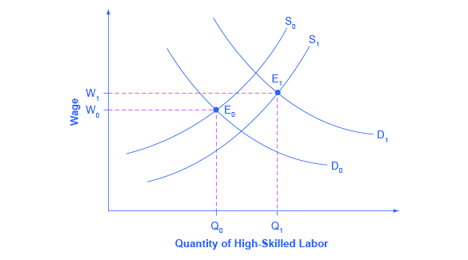

By the end of this section, you will be able to:
* Explain the distribution of income, and analyze the sources of income inequality in a market economy
* Measure income distribution in quintiles
* Calculate and graph a Lorenz curve
* Show income inequality through demand and supply diagrams

Poverty levels can be subjective based on the overall income levels of a country; typically poverty is measured based on a percentage of the median income. Income inequality, however, has to do with the distribution of that income, in terms of which group receives the most or the least income. Income inequality involves comparing those with high incomes, middle incomes, and low incomes—not just looking at those below or near the poverty line. In turn, measuring income inequality means dividing up the population into various groups and then comparing the groups, a task that can be carried out in several ways, as the next Clear It Up feature shows.

How do you separate poverty and income inequality?

Poverty can change even when inequality does not move at all. Imagine a situation in which income for everyone in the population declines by 10%. Poverty would rise, since a greater share of the population would now fall below the poverty line. However, inequality would be the same, because everyone suffered the same proportional loss. Conversely, a general rise in income levels over time would keep inequality the same, but reduce poverty.

It is also possible for income inequality to change without affecting the poverty rate. Imagine a situation in which a large number of people who already have high incomes increase their incomes by even more. Inequality would rise as a result—but the number of people below the poverty line would remain unchanged.

Why did inequality of household income increase in the United States in recent decades? Indeed, a trend toward greater income inequality has occurred in many countries around the world, although the effect has been more powerful in the U.S. economy. Economists have focused their explanations for the increasing inequality on two factors that changed more or less continually from the 1970s into the 2000s. One set of explanations focuses on the changing shape of American households; the other focuses on greater inequality of wages, what some economists call “winner take all” **labor markets**{: data-type="term" .no-emphasis}. We will begin with how we measure inequality, and then consider the explanations for growing inequality in the United States.

# Measuring Income Distribution by Quintiles   {#ch14mod04_01}

One common way of measuring income inequality is to rank all households by income, from lowest to highest, and then to divide all households into five groups with equal numbers of people, known as **quintiles**{: data-type="term"}. This calculation allows for measuring the distribution of income among the five groups compared to the total. The first quintile is the lowest fifth or 20%, the second quintile is the next lowest, and so on. Income inequality can be measured by comparing what share of the total income is earned by each quintile.

U.S. income distribution by quintile appears in [\[link\]](#ch14mod04_tab07). In 2011, for example, the bottom quintile of the income distribution received 3.2% of income; the second quintile received 8.4%; the third quintile, 14.3%; the fourth quintile, 23.0%; and the top quintile, 51.14%. The final column of [\[link\]](#ch14mod04_tab07) shows what share of income went to households in the top 5% of the income distribution: 22.3% in 2011. Over time, from the late 1960s to the early 1980s, the top fifth of the income distribution typically received between about 43% to 44% of all income. The share of income that the top fifth received then begins to rise. According to the Census Bureau, much of this increase in the share of income going to the top fifth can be traced to an increase in the share of income going to the top 5%. The quintile measure shows how income inequality has increased in recent decades.

<table id="ch14mod04_tab07" summary="The table shows the income received by the top 5% percent of the income distribution between 1967 and 2011. Column 1 lists the year. Column 2 lists the lowest quintile. Column 3 lists the second quintile. Column 4 lists the third quintile. Column 5 lists the fourth quintile. Column 6 lists the highest quintile. Column 7 lists the top 5%. The year 1967 = 4.0 lowest quintile; 10.8 second quintile; 17.3 third quintile; 24.2 fourth quintile; 43.6 highest quintile; 17.2 top 5%. The year 1970 = 4.1 lowest quintile; 10.8 second quintile; 17.4 third quintile; 24.5 fourth quintile; 43.3 highest quintile; 16.6 top 5%. The year 1975 = 4.3 lowest quintile; 10.4 second quintile; 17.0 third quintile; 24.7 fourth quintile; 43.6 highest quintile; 16.5 top 5%. The year 1980 = 4.2 lowest quintile; 10.2 second quintile; 16.8 third quintile; 24.7 fourth quintile; 44.1 highest quintile; 16.5 top 5%. The year 1985 = 3.9 lowest quintile; 9.8 second quintile; 16.2 third quintile; 24.4 fourth quintile; 45.6 highest quintile; 17.6 top 5%. The year 1990 = 3.8 lowest quintile; 9.6 second quintile; 15.9 third quintile; 24.0 fourth quintile; 46.6 highest quintile; 18.5 top 5%. The year 1995 = 3.7 lowest quintile; 9.1 second quintile; 15.2 third quintile; 23.3 fourth quintile; 48.7 highest quintile; 21.0 top 5%. The year 2000 = 3.6 lowest quintile; 8.9 second quintile; 14.8 third quintile; 23.0 fourth quintile; 49.8 highest quintile; 22.1 top 5%. The year 2005 = 3.4 lowest quintile; 8.6 second quintile; 14.6 third quintile; 23.0 fourth quintile; 50.4 highest quintile; 22.2 top 5%. The year 2010 = 3.3 lowest quintile; 8.5 second quintile; 14.6 third quintile; 23.4 fourth quintile; 50.3 highest quintile; 21.3 top 5%. The year 2011 = 3.2 lowest quintile; 8.4 second quintile; 14.3 third quintile; 23.0 fourth quintile; 51.1 highest quintile; 22.3 top 5%."><caption>Share of Aggregate Income Received by Each Fifth and Top 5% of Households, 1967–2011(Source: U.S. Census Bureau, Table H-2)</caption><thead>
<tr>
<th>Year</th>
<th>Lowest Quintile</th>
<th>Second Quintile</th>
<th>Third Quintile</th>
<th>Fourth Quintile</th>
<th>Highest Quintile</th>
<th>Top 5%</th>
</tr>
</thead><tbody>
<tr>
<td>1967</td>
<td>4.0</td>
<td>10.8</td>
<td>17.3</td>
<td>24.2</td>
<td>43.6</td>
<td>17.2</td>
</tr>
<tr>
<td>1970</td>
<td>4.1</td>
<td>10.8</td>
<td>17.4</td>
<td>24.5</td>
<td>43.3</td>
<td>16.6</td>
</tr>
<tr>
<td>1975</td>
<td>4.3</td>
<td>10.4</td>
<td>17.0</td>
<td>24.7</td>
<td>43.6</td>
<td>16.5</td>
</tr>
<tr>
<td>1980</td>
<td>4.2</td>
<td>10.2</td>
<td>16.8</td>
<td>24.7</td>
<td>44.1</td>
<td>16.5</td>
</tr>
<tr>
<td>1985</td>
<td>3.9</td>
<td>9.8</td>
<td>16.2</td>
<td>24.4</td>
<td>45.6</td>
<td>17.6</td>
</tr>
<tr>
<td>1990</td>
<td>3.8</td>
<td>9.6</td>
<td>15.9</td>
<td>24.0</td>
<td>46.6</td>
<td>18.5</td>
</tr>
<tr>
<td>1995</td>
<td>3.7</td>
<td>9.1</td>
<td>15.2</td>
<td>23.3</td>
<td>48.7</td>
<td>21.0</td>
</tr>
<tr>
<td>2000</td>
<td>3.6</td>
<td>8.9</td>
<td>14.8</td>
<td>23.0</td>
<td>49.8</td>
<td>22.1</td>
</tr>
<tr>
<td>2005</td>
<td>3.4</td>
<td>8.6</td>
<td>14.6</td>
<td>23.0</td>
<td>50.4</td>
<td>22.2</td>
</tr>
<tr>
<td>2010</td>
<td>3.3</td>
<td>8.5</td>
<td>14.6</td>
<td>23.4</td>
<td>50.3</td>
<td>21.3</td>
</tr>
<tr>
<td>2011</td>
<td>3.2</td>
<td>8.4</td>
<td>14.3</td>
<td>23.0</td>
<td>51.1</td>
<td>22.3</td>
</tr>
</tbody></table>

It can also be useful to divide the income distribution in ways other than quintiles; for example, into tenths or even into percentiles (that is, hundredths). A more detailed breakdown can provide additional insights. For example, the last column of [\[link\]](#ch14mod04_tab07) shows the income received by the top 5% percent of the income distribution. Between 1980 and 2011, the share of income going to the top 5% increased by 5.8 percentage points (from 16.5% in 1980 to 22.3% in 2011). From 1980 to 2011 the share of income going to the top quintile increased by 7.0 percentage points (from 44.1% in 1980 to 51.1% in 2011). Thus, the top 20% of householders (the fifth quintile) received over half (51.1%) of all the income in the United States in 2011.

# Lorenz Curve   {#ch14mod04_02}

The data on income inequality can be presented in various ways. For example, you could draw a bar graph that showed the share of income going to each fifth of the income distribution. [\[link\]](#CNX_Econ_C14_004) presents an alternative way of showing inequality data in what is called a **Lorenz curve**{: data-type="term"}. The Lorenz curve shows the cumulative share of population on the horizontal axis and the cumulative percentage of total income received on the vertical axis.

 {: #CNX_Econ_C14_004 data-title="The Lorenz Curve"}

Every Lorenz curve diagram begins with a line sloping up at a 45-degree angle, shown as a dashed line in [\[link\]](#CNX_Econ_C14_004). The points along this line show what perfect equality of the income distribution looks like. It would mean, for example, that the bottom 20% of the income distribution receives 20% of the total income, the bottom 40% gets 40% of total income, and so on. The other lines reflect actual U.S. data on inequality for 1980 and 2011.

The trick in graphing a Lorenz curve is that you must change the shares of income for each specific quintile, which are shown in the first column of numbers in [\[link\]](#ch14mod04_tab08), into cumulative income, shown in the second column of numbers. For example, the bottom 40% of the cumulative income distribution will be the sum of the first and second quintiles; the bottom 60% of the cumulative income distribution will be the sum of the first, second, and third quintiles, and so on. The final entry in the cumulative income column needs to be 100%, because by definition, 100% of the population receives 100% of the income.

<table id="ch14mod04_tab08" summary="The table shows the data needed to calculate a Lorenz curve that shows the changes in income distribution between 1980 and 2011. Column 1 lists the income category. Column 2 lists the share of income in 1980 (%). Column 3 lists the cumulative share of income in 1980 (%). Column 4 lists the share of income in 2011 (%). Column 5 lists the cumulative share of income in 2011 (%). First quintile = 4.2% share of income in 1980; 4.2% cumulative share of income in 1980; 3.2% share of income in 2011; 3.2% cumulative share of income in 2011. Second quintile = 10.2% share of income in 1980; 14.4% cumulative share of income in 1980; 8.4% share of income in 2011; 11.6% cumulative share of income in 2011. Third quintile = 16.8% share of income in 1980; 31.2% cumulative share of income in 1980; 14.3% share of income in 2011; 25.9% cumulative share of income in 2011. Fourth quintile = 24.7% share of income in 1980; 55.9% cumulative share of income in 1980; 23.0% share of income in 2011; 48.9% cumulative share of income in 2011. Fifth quintile = 44.1% share of income in 1980; 100.0% cumulative share of income in 1980; 51.1% share of income in 2011; 100.0% cumulative share of income in 2011."><caption>Calculating the Lorenz Curve</caption><thead>
<tr>
<th>Income Category</th>
<th>Share of Income in 1980 (%)</th>
<th>Cumulative Share of Income in 1980 (%)</th>
<th>Share of Income in 2011 (%)</th>
<th>Cumulative Share of Income in 2011 (%)</th>
</tr>
</thead><tbody>
<tr>
<td>First quintile</td>
<td>4.2</td>
<td>4.2</td>
<td>3.2</td>
<td>3.2</td>
</tr>
<tr>
<td>Second quintile</td>
<td>10.2</td>
<td>14.4</td>
<td>8.4</td>
<td>11.6</td>
</tr>
<tr>
<td>Third quintile</td>
<td>16.8</td>
<td>31.2</td>
<td>14.3</td>
<td>25.9</td>
</tr>
<tr>
<td>Fourth quintile</td>
<td>24.7</td>
<td>55.9</td>
<td>23.0</td>
<td>48.9</td>
</tr>
<tr>
<td>Fifth quintile</td>
<td>44.1</td>
<td>100.0</td>
<td>51.1</td>
<td>100.0</td>
</tr>
</tbody></table>

In a Lorenz curve diagram, a more unequal distribution of income will loop farther down and away from the 45-degree line, while a more equal distribution of income will move the line closer to the 45-degree line. The greater inequality of the U.S. income distribution between 1980 and 2011 is illustrated in [\[link\]](#CNX_Econ_C14_004) because the Lorenz curve for 2011 is farther from the 45-degree line than the Lorenz curve for 1980. The Lorenz curve is a useful way of presenting the quintile data that provides an image of all the quintile data at once. The next Clear It Up feature shows how income inequality differs in various countries compared to the United States.

How does economic inequality vary around the world?

The U.S. economy has a relatively high degree of income inequality by global standards. As [\[link\]](#ch14mod04_tab09) shows, based on a variety of national surveys done for a selection of years in the last five years of the 2000s (with the exception of Germany, and adjusted to make the measures more comparable), the U.S. economy has greater inequality than Germany (along with most Western European countries). The region of the world with the highest level of income inequality is Latin America, illustrated in the numbers for Brazil and Mexico. The level of inequality in the United States is lower than in some of the low-income countries of the world, like China and Nigeria, or some middle-income countries like the Russian Federation. However, not all poor countries have highly unequal income distributions; India provides a counterexample.

<table id="ch14mod04_tab09" summary="The table shows the income distribution in select countries. Column 1 lists the country. Column 2 lists the survey year. Column 3 lists the first quintile. Column 4 lists the second quintile. Column 5 lists the third quintile. Column 6 lists the fourth quintile. Column 7 lists the fifth quintile. United States in the year 2011 = 3.2% first quintile; 8.4% second quintile; 14.3% third quintile; 23.0% fourth quintile; 51.1% fifth quintile. Germany in the year 2000 = 8.5% first quintile; 13.7% second quintile; 17.8% third quintile; 23.1% fourth quintile; 36.9% fifth quintile. Brazil in the year 2009 = 2.9% first quintile; 7.1% second quintile; 12.4% third quintile; 19.0% fourth quintile; 58.6% fifth quintile. Mexico in the year 2010 = 4.9% first quintile; 8.8% second quintile; 13.3% third quintile; 20.2% fourth quintile; 52.8% fifth quintile. China in the year 2009 = 4.7% first quintile; 9.7% second quintile; 15.3% third quintile; 23.2% fourth quintile; 47.1% fifth quintile. India in the year 2010 = 8.5% first quintile; 12.1% second quintile; 15.7% third quintile; 20.8% fourth quintile; 42.8% fifth quintile. Russia in the year 2009 = 6.1% first quintile; 10.4% second quintile; 14.8% third quintile; 21.3% fourth quintile; 47.1% fifth quintile. Nigeria in the year 2010 = 4.4% first quintile; 8.3% second quintile; 13.0% third quintile; 20.3% fourth quintile; 54.0% fifth quintile."><caption>Income Distribution in Select Countries(Source: U.S. data from U.S. Census Bureau Table H-2. Other data from The World Bank Poverty and Inequality Data Base, http://databank.worldbank.org/data/views/reports/tableview.aspx#)</caption><thead>
<tr>
<th>Country</th>
<th>Survey Year</th>
<th>First Quintile</th>
<th>Second Quintile</th>
<th>Third Quintile</th>
<th>Fourth Quintile</th>
<th>Fifth Quintile</th>
</tr>
</thead><tbody>
<tr>
<td>United States</td>
<td>2011</td>
<td>3.2%</td>
<td>8.4%</td>
<td>14.3%</td>
<td>23.0%</td>
<td>51.1%</td>
</tr>
<tr>
<td>Germany</td>
<td>2000</td>
<td>8.5%</td>
<td>13.7%</td>
<td>17.8%</td>
<td>23.1%</td>
<td>36.9%</td>
</tr>
<tr>
<td>Brazil</td>
<td>2009</td>
<td>2.9%</td>
<td>7.1%</td>
<td>12.4%</td>
<td>19.0%</td>
<td>58.6%</td>
</tr>
<tr>
<td>Mexico</td>
<td>2010</td>
<td>4.9%</td>
<td>8.8%</td>
<td>13.3%</td>
<td>20.2%</td>
<td>52.8%</td>
</tr>
<tr>
<td>China</td>
<td>2009</td>
<td>4.7%</td>
<td>9.7%</td>
<td>15.3%</td>
<td>23.2%</td>
<td>47.1%</td>
</tr>
<tr>
<td>India</td>
<td>2010</td>
<td>8.5%</td>
<td>12.1%</td>
<td>15.7%</td>
<td>20.8%</td>
<td>42.8%</td>
</tr>
<tr>
<td>Russia</td>
<td>2009</td>
<td>6.1%</td>
<td>10.4%</td>
<td>14.8%</td>
<td>21.3%</td>
<td>47.1%</td>
</tr>
<tr>
<td>Nigeria</td>
<td>2010</td>
<td>4.4%</td>
<td>8.3%</td>
<td>13.0%</td>
<td>20.3%</td>
<td>54.0%</td>
</tr>
</tbody></table>

Visit this [website][1] to watch a video of wealth inequality across the world.

  

# Causes of Growing Inequality: The Changing Composition of American Households   {#ch14mod04_03}

In 1970, 41% of married women were in the labor force, but by 2011, according to the Bureau of Labor Statistics, 60.2% of married women were in the labor force. One result of this trend is that more households have two earners. Moreover, it has become more common for one high earner to marry another high earner. A few decades ago, the common pattern featured a man with relatively high earnings, such as an executive or a doctor, marrying a woman who did not earn as much, like a secretary or a nurse. Often, the woman would leave paid employment, at least for a few years, to raise a family. However, now doctors are marrying doctors and executives are marrying executives, and mothers with high-powered careers are often returning to work while their children are quite young. This pattern of households with two high earners tends to increase the proportion of high-earning households.

According to data in the National Journal, even as two-earner couples have increased, so have single-parent households. Of all U.S. families, 13.1% were headed by single mothers; the poverty rate among single-parent households tends to be relatively high.

These changes in family structure, including the growth of single-parent families who tend to be at the lower end of the income distribution, and the growth of two-career high-earner couples near the top end of the income distribution, account for roughly half of the rise in income inequality across households in recent decades.

Visit this [website][2] to watch a video that illustrates the distribution of wealth in the United States.

  

# Causes of Growing Inequality: A Shift in the Distribution of Wages   {#ch14mod04_04}

Another factor behind the rise in U.S. income inequality is that earnings have become less equal since the late 1970s. In particular, the earnings of high-skilled labor relative to low-skilled labor have increased. Winner-take-all labor markets result from changes in technology, which have increased global demand for “stars,”—whether the best CEO, doctor, basketball player, or actor. One way to measure this change is to take the earnings of workers with at least a four-year college bachelor’s degree (including those who went on and completed an advanced degree) and divide them by the earnings of workers with only a high school degree. The result is that those in the 25–34 age bracket with college degrees earned about 1.67 times as much as high school graduates in 2010, up from 1.59 times in 1995, according to U.S. Census data.

Economists use the demand and supply model to reason through the most likely causes of this shift. According to the National Center for Education Statistics, in recent decades, the supply of U.S. workers with college degrees has increased substantially; for example, 840,000 four-year bachelor’s degrees were conferred on Americans in 1970; in 2009–2010, 1,602,480 such degrees were conferred—an increase of about 90%. In [\[link\]](#CNX_Econ_C14_006), this shift in supply to the right, from S0 to S1, should result in a lower equilibrium wage for high-skilled labor. Thus, the increase in the price of high-skilled labor must be explained by a greater demand, like the movement from D0 to D1. Evidently, combining both the increase in supply and in demand has resulted in a shift from E0 to E1, and a resulting higher wage.

{: #CNX_Econ_C14_006 data-title="Why Would Wages Rise for High-Skilled Labor?"}

What factors would cause the demand for high-skilled labor to rise? The most plausible explanation is that while the explosion in new information and communications technologies over the last several decades has helped many workers to become more productive, the benefits have been especially great for high-skilled workers like top business managers, consultants, and design professionals. The new technologies have also helped to encourage **globalization**{: data-type="term" .no-emphasis}, the remarkable increase in international trade over the last few decades, by making it more possible to learn about and coordinate economic interactions all around the world. In turn, the rising impact of foreign trade in the U.S. economy has opened up greater opportunities for high-skilled workers to sell their services around the world.

The market for high-skilled labor can be viewed as a race between forces of supply and demand. Additional education and on-the-job training will tend to increase the supply of high-skilled labor and to hold down its relative wage. Conversely, new technology and other economic trends like globalization tend to increase the demand for high-skilled labor and push up its relative wage. The greater inequality of wages can be viewed as a sign that demand for skilled labor is increasing faster than supply. On the other hand, if the supply of lower skilled workers exceeds the demand, then average wages in the lower quintiles of the income distribution will decrease. The combination of forces in the high-skilled and low-skilled labor markets leads to increased income disparity.

# Key Concepts and Summary   {#ch14mod04_summ}

Measuring inequality involves making comparisons across the entire distribution of income, not just the poor. One way of doing this is to divide the population into groups, like quintiles, and then calculate what share of income is received by each group. An alternative approach is to draw Lorenz curves, which compare the cumulative income actually received to a perfectly equal distribution of income. Income inequality in the United States increased substantially from the late 1970s and early 1980s into the 2000s. The two most common explanations cited by economists are changes in the structure of households that have led to more two-earner couples and single-parent families, and the effect of new information and communications technology on wages.

# Self-Check Questions   {#ch14mod04_sques}

A group of 10 people have the following annual incomes: $24,000, $18,000, $50,000, $100,000, $12,000, $36,000, $80,000, $10,000, $24,000, $16,000. Calculate the share of total income received by each quintile of this income distribution. Do the top and bottom quintiles in this distribution have a greater or larger share of total income than the top and bottom quintiles of the U.S. income distribution?

A useful first step is to rank the households by income, from lowest to highest. Then, since there are 10 households total, the bottom quintile will be the bottom two households, the second quintile will be the third and fourth households, and so on up to the top quintile. The quintiles and percentage of total income for the data provided are shown in the following table. Comparing this distribution to the U.S. income distribution for 2005, the top quintile in the example has a smaller share of total income than in the U.S. distribution and the bottom quintile has a larger share. This pattern usually means that the income distribution in the example is more equal than the U.S. distribution. <table id="ch14mod04_tab10" summary="The table shows the quintiles and percentage of total income for the data provided in order to measure income inequality. Column 1 lists the income. Column 2 lists the quintile. Column 3 lists the percentage of total income. $10,000 income and $12,000 income; Total first quintile income: $22,000; 6.0% of total income. $16,000 income and $18,000 income; Total second quintile income: $34,000; 9.2% of total income. $24,000 income and $24,000 income; Total third quintile income: $48,000; 13.0% of total income. $36,000 income and $50,000 income; Total fourth quintile income: $86,000; 23.3% of total income. $80,000 income and $100,000 income; Total top quintile income: $180,000; $48.6% of total income. $370,000 = Total Income." data-label=""><thead>
<tr>
<th>Income</th>
<th>Quintile</th>
<th>% of Total Income</th>
</tr>
</thead><tbody>
<tr>
<td>$10,000</td>
<td rowspan="2">Total first quintile income: $22,000</td>
<td rowspan="2">6.0%</td>
</tr>
<tr>
<td>$12,000</td>
</tr>
<tr>
<td>$16,000</td>
<td rowspan="2">Total second quintile income: $34,000</td>
<td rowspan="2">9.2%</td>
</tr>
<tr>
<td>$18,000</td>
</tr>
<tr>
<td>$24,000</td>
<td rowspan="2">Total third quintile income: $48,000</td>
<td rowspan="2">13.0%</td>
</tr>
<tr>
<td>$24,000</td>
</tr>
<tr>
<td>$36,000</td>
<td rowspan="2">Total fourth quintile income: $86,000</td>
<td rowspan="2">23.2%</td>
</tr>
<tr>
<td>$50,000</td>
</tr>
<tr>
<td>$80,000</td>
<td rowspan="2">Total top quintile income: $180,000</td>
<td rowspan="2">48.6%</td>
</tr>
<tr>
<td>$100,000</td>
</tr>
<tr>
<td><strong>$370,000</strong></td>
<td><strong>Total Income</strong></td>
<td />
</tr>
</tbody></table>

[[link]](#ch14mod04_tab11) shows the share of income going to each quintile of the income distribution for the United Kingdom in 1979 and 1991. Use this data to calculate what the points on a Lorenz curve would be, and sketch the Lorenz curve. How did inequality in the United Kingdom shift over this time period? How can you see the patterns in the quintiles in the Lorenz curves? <table id="ch14mod04_tab11" summary="The table shows the share of income going to each quintile of the income distribution for the United Kingdom in 1979 and 1991. Column 1 lists the share of income. Column 2 lists the percentages for the year 1979. Column 3 lists the percentages for the year 1991. Top quintile = 39.7% in 1979; 42.9% in 1991. Fourth quintile = 24.8% in 1979; 22.7% in 1991. Middle quintile =  17.0% in 1979; 16.3% in 1991. Second quintile = 11.5% in 1979; 11.5% in 1991. Bottom quintile = 7.0% in 1979; 6.6% in 1991."><caption>Income Distribution in the United Kingdom, 1979 and 1991</caption><thead>
<tr>
<th>Share of Income</th>
<th>1979</th>
<th>1991</th>
</tr>
</thead><tbody>
<tr>
<td>Top quintile</td>
<td>39.7%</td>
<td>42.9%</td>
</tr>
<tr>
<td>Fourth quintile</td>
<td>24.8%</td>
<td>22.7%</td>
</tr>
<tr>
<td>Middle quintile</td>
<td>17.0%</td>
<td>16.3%</td>
</tr>
<tr>
<td>Second quintile</td>
<td>11.5%</td>
<td>11.5%</td>
</tr>
<tr>
<td>Bottom quintile</td>
<td>7.0%</td>
<td>6.6%</td>
</tr>
</tbody></table>

Just from glancing at the quintile information, it is fairly obvious that income inequality increased in the United Kingdom over this time: The top quintile is getting a lot more, and the lowest quintile is getting a bit less. Converting this information into a Lorenz curve, however, is a little trickier, because the Lorenz curve graphs the cumulative distribution, not the amount received by individual quintiles. Thus, as explained in the text, you have to add up the individual quintile data to convert the data to this form. The following table shows the actual calculations for the share of income in 1979 versus 1991. The figure following the table shows the perfect equality line and the Lorenz curves for 1979 and 1991. As shown, the income distribution in 1979 was closer to the perfect equality line than the income distribution in 1991—that is, the United Kingdom income distribution became more unequal over time. | Share of income received | 1979 | 1991 |
|----------
| Bottom 20% | 7.0% | 6.6% |
| Bottom 40% | 18.5% | 18.1% |
| Bottom 60% | 35.5% | 34.4% |
| Bottom 80% | 60.3% | 57.1% |
| All 100% | 100.0% | 100.0% |
{: #ch14mod04_tab12 summary="The table shows the actual calculations for the share of income in the United Kingdom in 1979 and 1991. Column 1 shows the share of income received. Column 2 shows the percentage in 1979. Column 3 shows the percentage in 1991. Bottom 20% share of income received = 7.0% in 1979; 6.6% in 1991. Bottom 40% share of income received = 18.5% in 1979; 18.1% in 1991. Bottom 60% share of income received = 35.5% in 1979; 34.4% in 1991. Bottom 80% share of income received = 60.3% in 1979; 57.1% in 1991. All 100% share of income received = 100.0% in 1979; 100.0% in 1991." data-label=""}

 ![This graph shows two Lorenz curves: one for the year 1979 and the other for the year 1991. There is also a dashed, straight line, with a slope of 1 that shows perfect equality. The x-axis is labeled income quintiles, and is marked off in increments of 20 from 20 to 100. The y-axis is labeled cumulative share of income and is marked off in percent increments of 20 from 20-100. The coordinates for the 1979 Lorenz curve are (20, 7), (40, 18.5), (60, 35.5), (80, 60.3), (100, 100). The coordinates for the 1991 Lorenz curve are (20, 6.6), (40, 18.1), (60, 34.4), (80, 57.1), (100, 100).](../resources/CNX_Econ_C14_015.jpg ""){: #CNX_Econ_C14_015 data-title=""}

Using two demand and supply diagrams, one for the low-wage labor market and one for the high-wage labor market, explain how information technology can increase income inequality if it is a complement to high-income workers like salespeople and managers, but a substitute for low-income workers like file clerks and telephone receptionists.

In the market for low-wage labor, information technology shifts the demand for low-wage labor to the left. One reason is that technology can often substitute for low-wage labor in certain kinds of telephone or bookkeeping jobs. In addition, information technology makes it easier for companies to manage connections with low-wage workers in other countries, thus reducing the demand for low-wage workers in the United States. In the market for high-wage labor, information technology shifts the demand for high-wage labor to the right. By using the new information and communications technologies, high-wage labor can become more productive and can oversee more tasks than before. The following figure illustrates these two labor markets. The combination of lower wages for low-wage labor and higher wages for high-wage labor means greater inequality. ![This figure shows two graphs. Graph (a) is titled low-wage labor market. The x-axis is labeled quantity and the y-axis is labeled wage. There is a line labeled S that has a slope of about 1. There is another line labeled D with arrows showing it shifting to the left. There are broken lines running from the intersection points of S and D to the x- and y-axes which show the area decreasing. Graph (b) is titled high-wage labor market. The x-axis is labeled quantity and the y-axis is labeled wage. There is a line labeled S that has a slope of about 1. It intersects with another line labeled D with arrows showing it shifting to the right. There are broken lines running from the intersection points of S and D to the x- and y-axes which show the area increasing.](../resources/CNX_Econ_C14_011.jpg ""){: #CNX_Econ_C14_011 data-title=""}

Using two demand and supply diagrams, one for the low-wage labor market and one for the high-wage labor market, explain how a program that increased educational levels for a substantial number of low-skill workers could reduce income inequality.

In the market for low-wage labor, a skills program will shift supply to the left, which will tend to drive up wages for the remaining low-skill workers. In the market for high-wage labor, a skills program will shift supply to the right (because after the training program there are now more high-skilled workers at every wage), which will tend to drive down wages for high-skill workers. The combination of these two programs will result in a lesser degree of inequality. The following figure illustrates these two labor markets. In the market for high-wage labor, a skills program will shift supply to the right, which will tend to drive down wages for high-skill workers. ![This figure shows two graphs. Graph (a) is titled low-wage labor market. The x-axis is labeled quantity and the y-axis is labeled wage. There is a line D which is constant. The graph shows a line S, moving to the left. There are broken lines that connect the x- and y- axis through the intersections of lines D and S that show the area changing. Graph (b) is titled high-wage labor market. The x-axis is labeled quantity and the y-axis is labeled wage. There is a line D which is constant. The graph shows a line S, moving to the right. There are broken lines that connect the x- and y- axis through the intersections of lines D and S that show the area changing.](../resources/CNX_Econ_C14_010.jpg ""){: #CNX_Econ_C14_010 data-title=""}

# Review Questions   {#ch14mod04_rques}

Who is included in the top income quintile?

What is measured on the two axes of a Lorenz curve?

If a country had perfect income equality what would the Lorenz curve look like?

How has the inequality of income changed in the U.S. economy since the late 1970s?

What are some reasons why a certain degree of inequality of income would be expected in a market economy?

What are the main reasons economists give for the increase in inequality of incomes?

# Critical Thinking Questions   {#ch14mod04_ctques}

Explain how a country may experience greater equality in the distribution of income, yet still experience high rates of poverty *Hint*: Look at the [Clear It Up](/m48683#ch14mod01_clearup) "How is poverty measured in low-income countries?" and compare to [[link]](#ch14mod04_tab07).

The demand for skilled workers in the United States has been increasing. To increase the supply of skilled workers, many argue that immigration reform to allow more skilled labor into the United States is needed. Explain whether you agree or disagree.

Explain a situation using the supply and demand for skilled labor in which the increased number of college graduates leads to depressed wages. Given the rising cost of going to college, explain why a college education will or will not increase income inequality.

# Problems   {#ch14mod04_prob}

A group of 10 people have the following annual incomes: $55,000, $30,000, $15,000, $20,000, $35,000, $80,000, $40,000, $45,000, $30,000, $50,000. Calculate the share of total income received by each quintile of this income distribution. Do the top and bottom quintiles in this distribution have a greater or larger share of total income than the top and bottom quintiles of the U.S. income distribution for 2005?

# References   {#ch14mod04_ref}

Frank, Robert H., and Philip J. Cook. *The Winner-Take-All Society*. New York: Martin Kessler Books at The Free Press, 1995.

Institute of Education Sciences: National Center for Education Statistics. “Fast Facts: Degrees Conferred by Sex and Race.” http://nces.ed.gov/fastfacts/display.asp?id=72.

Nhan, Doris. “Census: More in U.S. Report Nontraditional Households.” *National Journal*. Last modified May 1, 2012. http://www.nationaljournal.com/thenextamerica/demographics/census-more-in-u-s-report-nontraditional-households-20120430.

U.S. Bureau of Labor Statistics: BLS Reports. “Report 1040: Women in the Labor Force: A Databook.” Last modified March 26, 2013. http://www.bls.gov/cps/wlf-databook-2012.pdf.

U.S. Department of Commerce: United States Census Bureau. “Income: Table H-2. Share of Aggregate Income Received by Each Fifth and Top 5 Percent of Households.” http://www.census.gov/hhes/www/income/data/historical/household/.

[1]: http://openstaxcollege.org/l/inequality/
[2]: http://openstaxcollege.org/l/US_wealth
