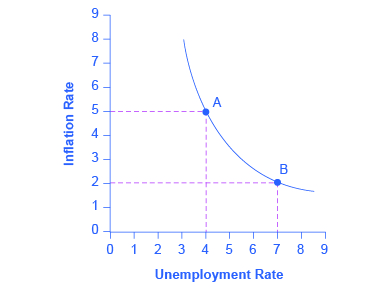
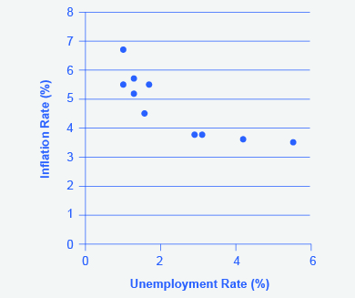
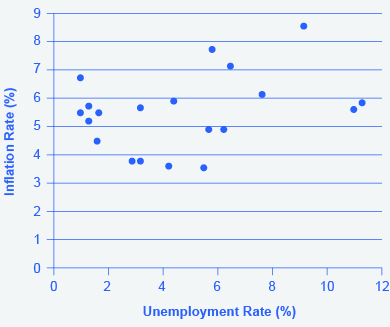
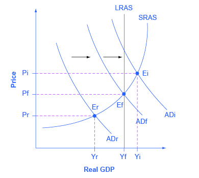

By the end of this section, you will be able to:
* Explain the Phillips curve, noting its impact on the theories of Keynesian economics
* Graph a Phillips curve
* Identify factors that cause the instability of the Phillips curve
* Analyze the Keynesian policy for reducing unemployment and inflation

The simplified AD/AS model that we have used so far is fully consistent with Keynes’s original model. More recent research, though, has indicated that in the real world, an aggregate supply curve is more curved than the right angle used in this chapter. Rather, the real-world AS curve is very flat at levels of output far below potential (“the Keynesian zone”), very steep at levels of output above potential (“the neoclassical zone”) and curved in between (“the intermediate zone”). This is illustrated in [\[link\]](#CNX_Econ_C25_034). The typical aggregate supply curve leads to the concept of the Phillips curve.

 largely determines the quantity of output. In the intermediate zone around equilibrium Ei, movement in AD to the right will increase both the output level and the price level, while a movement in AD to the left would decrease both the output level and the price level."){: #CNX_Econ_C25_034 data-media-type="image/jpg" data-title="Keynes, Neoclassical, and Intermediate Zones in the Aggregate Supply Curve"}

# The Discovery of the Phillips Curve   {#ch25mod03_01}

In the 1950s, **A.W. Phillips**{: data-type="term" .no-emphasis}, an economist at the London School of Economics, was studying the Keynesian analytical framework. The Keynesian theory implied that during a recession inflationary pressures are low, but when the level of output is at or even pushing beyond potential GDP, the economy is at greater risk for inflation. Phillips analyzed 60 years of British data and did find that tradeoff between unemployment and inflation, which became known as a **Phillips curve**{: data-type="term"}. [\[link\]](#CNX_Econ_C25_006) shows a theoretical Phillips curve, and the following Work It Out feature shows how the pattern appears for the United States.

 {: #CNX_Econ_C25_006 data-media-type="image/jpg" data-title="A Keynesian Phillips Curve Tradeoff between Unemployment and Inflation"}

The Phillips Curve for the United States

Step 1. Go to this [website][1] to see the 2005 Economic Report of the President.

Step 2. Scroll down and locate Table B-63 in the Appendices. This table is titled “Changes in special consumer price indexes, 1960–2004.”

Step 3. Download the table in Excel by selecting the XLS option and then selecting the location in which to save the file.

Step 4. Open the downloaded Excel file.

Step 5. View the third column (labeled “Year to year”). This is the inflation rate, measured by the percentage change in the Consumer Price Index.

Step 6. Return to the website and scroll to locate the Appendix Table B-42 “Civilian unemployment rate, 1959–2004.

Step 7. Download the table in Excel.

Step 8. Open the downloaded Excel file and view the second column. This is the overall unemployment rate.

Step 9. Using the data available from these two tables, plot the Phillips curve for 1960–69, with unemployment rate on the x-axis and the inflation rate on the y-axis. Your graph should look like [\[link\]](#CNX_Econ_C25_032).

{: #CNX_Econ_C25_032 data-media-type="image/jpg" data-title="The Phillips Curve from 1960&#x2013;1969"}

Step 10. Plot the Phillips curve for 1960–1979. What does the graph look like? Do you still see the tradeoff between inflation and unemployment? Your graph should look like [\[link\]](#CNX_Econ_C25_033).

{: #CNX_Econ_C25_033 data-media-type="image/jpg" data-title="U.S. Phillips Curve, 1960&#x2013;1979"}

Over this longer period of time, the Phillips curve appears to have shifted out. There is no tradeoff any more.

# The Instability of the Phillips Curve   {#ch25mod02_02}

During the 1960s, the Phillips curve was seen as a policy menu. A nation could choose low inflation and high unemployment, or high inflation and low unemployment, or anywhere in between. Fiscal and monetary policy could be used to move up or down the Phillips curve as desired. Then a curious thing happened. When policymakers tried to exploit the tradeoff between inflation and unemployment, the result was an increase in both inflation and unemployment. What had happened? The Phillips curve shifted.

The U.S. economy experienced this pattern in the deep recession from 1973 to 1975, and again in back-to-back recessions from 1980 to 1982. Many nations around the world saw similar increases in unemployment and inflation. This pattern became known as **stagflation**{: data-type="term" .no-emphasis}. (Recall from [The Aggregate Demand/Aggregate Supply Model](/m48739){: .target-chapter} that stagflation is an unhealthy combination of high unemployment and high inflation.) Perhaps most important, stagflation was a phenomenon that could not be explained by traditional Keynesian economics.

Economists have concluded that two factors cause the Phillips curve to shift. The first is supply shocks, like the Oil Crisis of the mid-1970s, which first brought stagflation into our vocabulary. The second is changes in people’s expectations about inflation. In other words, there may be a tradeoff between **inflation**{: data-type="term" .no-emphasis} and **unemployment**{: data-type="term" .no-emphasis} when people expect no inflation, but when they realize inflation is occurring, the tradeoff disappears. Both factors (supply shocks and changes in inflationary expectations) cause the aggregate supply curve, and thus the Phillips curve, to shift.

In short, a downward-sloping Phillips curve should be interpreted as valid for short-run periods of several years, but over longer periods, when aggregate supply shifts, the downward-sloping Phillips curve can shift so that unemployment and inflation are both higher (as in the 1970s and early 1980s) or both lower (as in the early 1990s or first decade of the 2000s).

# Keynesian Policy for Fighting Unemployment and Inflation   {#ch25mod02_03}

Keynesian macroeconomics argues that the solution to a recession is **expansionary fiscal policy**{: data-type="term"}, such as tax cuts to stimulate consumption and investment, or direct increases in government spending that would shift the aggregate demand curve to the right. For example, if aggregate demand was originally at ADr in [\[link\]](#CNX_Econ_C25_010), so that the economy was in recession, the appropriate policy would be for government to shift aggregate demand to the right from ADr to ADf, where the economy would be at potential GDP and full employment.

Keynes noted that while it would be nice if the government could spend additional money on housing, roads, and other amenities, he also argued that if the government could not agree on how to spend money in practical ways, then it could spend in impractical ways. For example, Keynes suggested building monuments, like a modern equivalent of the Egyptian pyramids. He proposed that the government could bury money underground, and let mining companies get started to dig the money up again. These suggestions were slightly tongue-in-cheek, but their purpose was to emphasize that a Great Depression is no time to quibble over the specifics of government spending programs and tax cuts when the goal should be to pump up aggregate demand by enough to lift the economy to **potential GDP**{: data-type="term" .no-emphasis}.

 {: #CNX_Econ_C25_010 data-media-type="image/jpg" data-title="Fighting Recession and Inflation with Keynesian Policy"}

The other side of Keynesian policy occurs when the economy is operating above potential GDP. In this situation, unemployment is low, but inflationary rises in the price level are a concern. The Keynesian response would be **contractionary fiscal policy**{: data-type="term"}, using tax increases or government spending cuts to shift AD to the left. The result would be downward pressure on the price level, but very little reduction in output or very little rise in unemployment. If aggregate demand was originally at ADi in [\[link\]](#CNX_Econ_C25_010), so that the economy was experiencing inflationary rises in the price level, the appropriate policy would be for government to shift aggregate demand to the left, from ADi toward ADf, which reduces the pressure for a higher price level while the economy remains at full employment.

In the Keynesian economic model, too little aggregate demand brings unemployment and too much brings inflation. Thus, you can think of Keynesian economics as pursuing a “Goldilocks” level of aggregate demand: not too much, not too little, but looking for what is just right.

# Key Concepts and Summary   {#ch25mod03_summ}

A Phillips curve shows the tradeoff between unemployment and inflation in an economy. From a Keynesian viewpoint, the Phillips curve should slope down so that higher unemployment means lower inflation, and vice versa. However, a downward-sloping Phillips curve is a short-term relationship that may shift after a few years.

Keynesian macroeconomics argues that the solution to a recession is expansionary fiscal policy, such as tax cuts to stimulate consumption and investment, or direct increases in government spending that would shift the aggregate demand curve to the right. The other side of Keynesian policy occurs when the economy is operating above potential GDP. In this situation, unemployment is low, but inflationary rises in the price level are a concern. The Keynesian response would be contractionary fiscal policy, using tax increases or government spending cuts to shift AD to the left.

# Self-Check Question   {#ch25mod03_sques}

How would a decrease in energy prices affect the Phillips curve?

A decrease in energy prices, a positive supply shock, would cause the AS curve to shift out to the right, yielding more real GDP at a lower price level. This would shift the Phillips curve down toward the origin, meaning the economy would experience lower unemployment and a lower rate of inflation.

# Review Questions   {#ch25mod03_rques}

What tradeoff is shown by a Phillips curve?

Would you expect to see long-run data trace out a stable downward-sloping Phillips curve?

What is the Keynesian prescription for recession? For inflation?

# Critical Thinking Questions   {#ch25mod03_ctques}

Do you think the Phillips curve is a useful tool for analyzing the economy today? Why or why not?

# References   {#ch25mod03_ref}

Hoover, Kevin. “Phillips Curve.” *The Concise Encyclopedia of Economics*. http://www.econlib.org/library/Enc/PhillipsCurve.html.

U.S. Government Printing Office. “Economic Report of the President.” http://1.usa.gov/1c3psdL.

[1]: http://1.usa.gov/1c3psdL
