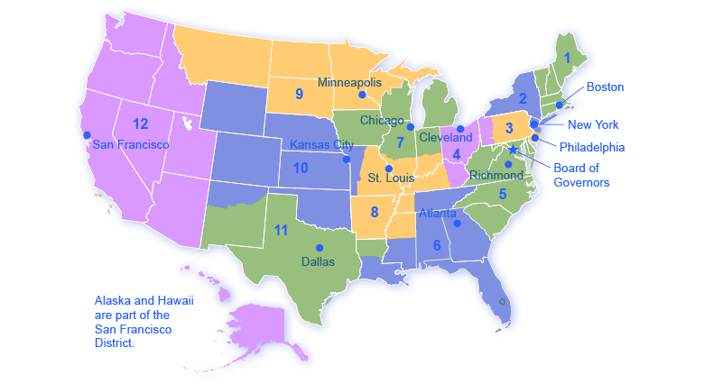

By the end of this section, you will be able to:

* Explain the structure and organization of the U.S. Federal Reserve
* Discuss how central banks impact monetary policy, promote financial stability, and provide banking services

In making decisions about the money supply, a central bank decides whether to raise or lower **interest rates**{: data-type="term" .no-emphasis} and, in this way, to influence macroeconomic policy, whose goal is low **unemployment**{: data-type="term" .no-emphasis} and low **inflation**{: data-type="term" .no-emphasis}. The central bank is also responsible for regulating all or part of the nation’s banking system to protect bank depositors and insure the health of the bank’s balance sheet.

The organization responsible for conducting **monetary policy**{: data-type="term" .no-emphasis} and ensuring that a nation’s financial system operates smoothly is called the **central bank**{: data-type="term"}. Most nations have central banks or currency boards. Some prominent central banks around the world include the European Central Bank, the Bank of Japan, and the Bank of England. In the United States, the central bank is called the Federal Reserve—often abbreviated as just “the Fed.” This section explains the organization of the U.S. **Federal Reserve**{: data-type="term" .no-emphasis} and identifies the major responsibilities of a central bank.

### Structure/Organization of the Federal Reserve

Unlike most central banks, the Federal Reserve is semi-decentralized, mixing government appointees with representation from private-sector banks. At the national level, it is run by a Board of Governors, consisting of seven members appointed by the President of the United States and confirmed by the Senate. Appointments are for 14-year terms and they are arranged so that one term expires January 31 of every even-numbered year. The purpose of the long and staggered terms is to insulate the Board of Governors as much as possible from political pressure so that policy decisions can be made based only on their economic merits. Additionally, except when filling an unfinished term, each member only serves one term, further insulating decision-making from politics. Policy decisions of the Fed do not require congressional approval, and the President cannot ask for the resignation of a Federal Reserve Governor as the President can with cabinet positions.

One member of the Board of Governors is designated as the Chair. For example, from 1987 until early 2006, the Chair was Alan Greenspan. From 2006 until 2014, Ben Bernanke held the post. The current Chair, Janet Yellen, has made many headlines already. Why? See the following Clear It Up feature to find out.

Who has the most immediate economic power in the world?

"){: #CNX_Econ_C28_012 data-title="Chair of the Federal Reserve Board "}

What individual can make financial market crash or soar just by making a public statement? It is not Bill Gates or Warren Buffett. It is not even the President of the United States. The answer is the Chair of the Federal Reserve Board of Governors. In early 2014, **Janet L. Yellen**{: data-type="term" .no-emphasis}, shown in [\[link\]](#CNX_Econ_C28_012) became the first woman to hold this post. Yellen has been described in the media as “perhaps the most qualified Fed chair in history.” With a Ph.D. in economics from Yale University, Yellen has taught macroeconomics at Harvard, the London School of Economics, and most recently at the University of California at Berkeley. From 2004–2010, Yellen was President of the Federal Reserve Bank of San Francisco. Not an ivory tower economist, Yellen became one of the few economists who warned about a possible bubble in the housing market, more than two years before the financial crisis occurred. Yellen served on the Board of Governors of the Federal Reserve twice, most recently as Vice Chair. She also spent two years as Chair of the President’s Council of Economic Advisors. If experience and credentials mean anything, Yellen is likely to be an effective Fed chair.

The Fed Chair is first among equals on the Board of Governors. While he or she has only one vote, the Chair controls the agenda, and is the public voice of the Fed, so he or she has more power and influence than one might expect.

Visit this [website][1] to see who the current members of the Federal Reserve Board of Governors are. You can follow the links provided for each board member to learn more about their backgrounds, experiences, and when their terms on the board will end.

  

The Federal Reserve is more than the Board of Governors. The Fed also includes 12 regional Federal Reserve banks, each of which is responsible for supporting the commercial banks and economy generally in its district. The Federal Reserve districts and the cities where their regional headquarters are located are shown in [\[link\]](#CNX_Econ_C28_001). The commercial banks in each district elect a Board of Directors for each regional Federal Reserve bank, and that board chooses a president for each regional Federal Reserve district. Thus, the Federal Reserve System includes both federally and private-sector appointed leaders.

{: #CNX_Econ_C28_001 data-title="The Twelve Federal Reserve Districts "}

### What Does a Central Bank Do?

The Federal Reserve, like most central banks, is designed to perform three important functions:

1.  To conduct monetary policy
2.  To promote stability of the financial system
3.  To provide banking services to commercial banks and other depository institutions, and to provide banking services to the federal government.
{: type="1"}

The first two functions are sufficiently important that we will discuss them in their own modules; the third function we will discuss here.

The Federal Reserve provides many of the same services to banks as banks provide to their customers. For example, all commercial banks have an account at the Fed where they deposit reserves. Similarly, banks can obtain loans from the Fed through the “discount window” facility, which will be discussed in more detail later. The Fed is also responsible for check processing. When you write a check, for example, to buy groceries, the grocery store deposits the check in its bank account. Then, the physical check (or an image of that actual check) is returned to your bank, after which funds are transferred from your bank account to the account of the grocery store. The Fed is responsible for each of these actions.

On a more mundane level, the Federal Reserve ensures that enough currency and coins are circulating through the financial system to meet public demands. For example, each year the Fed increases the amount of currency available in banks around the Christmas shopping season and reduces it again in January.

Finally, the Fed is responsible for assuring that banks are in compliance with a wide variety of consumer protection laws. For example, banks are forbidden from discriminating on the basis of age, race, sex, or marital status. Banks are also required to disclose publicly information about the loans they make for buying houses and how those loans are distributed geographically, as well as by sex and race of the loan applicants.

### Key Concepts and Summary

The most prominent task of a central bank is to conduct monetary policy, which involves changes to interest rates and credit conditions, affecting the amount of borrowing and spending in an economy. Some prominent central banks around the world include the U.S. Federal Reserve, the European Central Bank, the Bank of Japan, and the Bank of England.

### Self-Check Question

Why is it important for the members of the Board of Governors of the Federal Reserve to have longer terms in office than elected officials, like the President?

Longer terms insulate the Board from political forces. Since the presidency can potentially change every four years, the Federal Reserve’s independence prevents drastic swings in monetary policy with every new administration and allows policy decisions to be made only on economic grounds.

### Review Questions

How is a central bank different from a typical commercial bank?

List the three traditional tools that a central bank has for controlling the money supply.

### Critical Thinking Questions

Why do presidents typically reappoint Chairs of the Federal Reserve Board even when they were originally appointed by a president of a different political party?

In what ways might monetary policy be superior to fiscal policy? In what ways might it be inferior?

### References

Matthews, Dylan. “Nine amazing facts about Janet Yellen, our next Fed chair.” Wonkblog. *The Washington Post*. Posted October 09, 2013. http://www.washingtonpost.com/blogs/wonkblog/wp/2013/10/09/nine-amazing-facts-about-janet-yellen-our-next-fed-chair/.

Appelbaum, Binyamin. “Divining the Regulatory Goals of Fed Rivals.” *The New York Times*. Posted August 14, 2013. http://www.nytimes.com/2013/08/14/business/economy/careers-of-2-fed-contenders-reveal-little-on-regulatory-approach.html?pagewanted=3.

### Glossary
{: data-type="glossary-title"}

central bank
: institution which conducts a nation’s monetary policy and regulates its banking system

[1]: http://openstaxcollege.org/l/Governors
