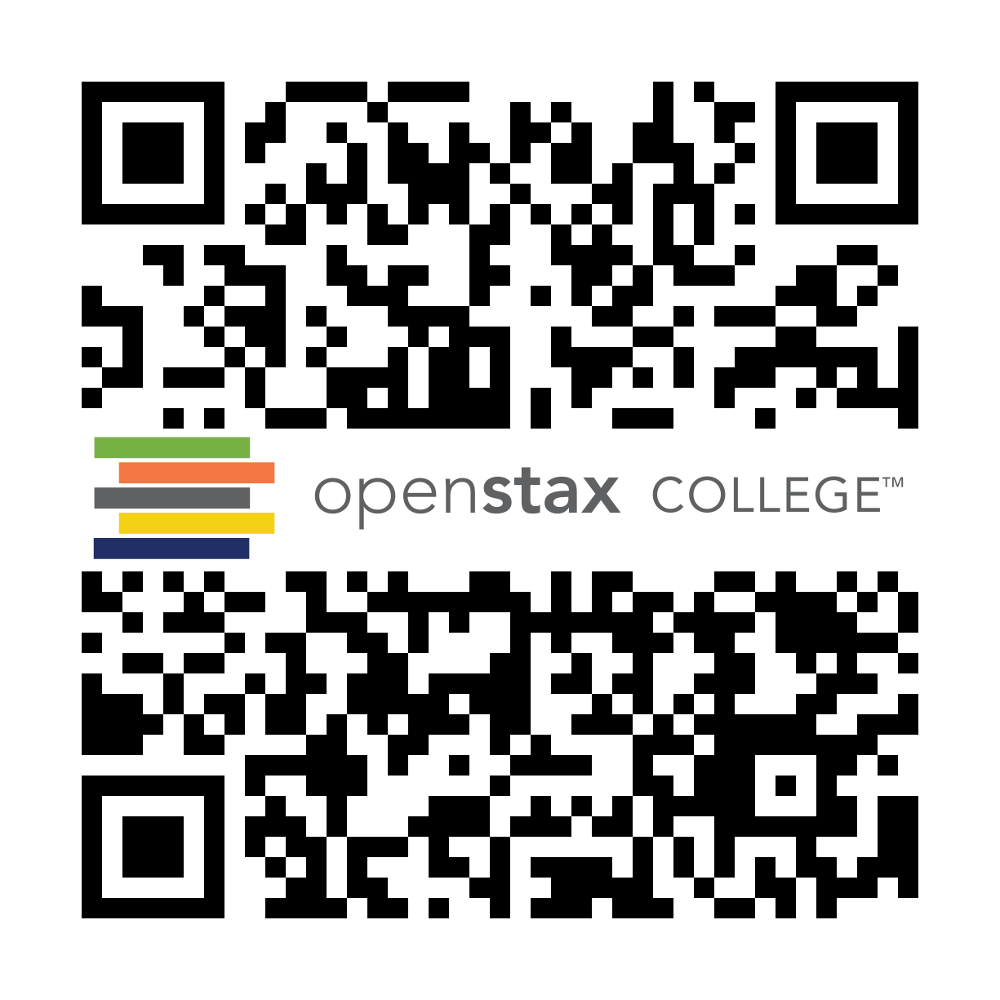

By the end of this section, you will be able to:

* Explain the reason for open market operations
* Evaluate reserve requirements and discount rates
* Interpret and show bank activity through balance sheets

The most important function of the Federal Reserve is to conduct the nation’s **monetary policy**{: data-type="term" .no-emphasis}. Article I, Section 8 of the U.S. Constitution gives Congress the power “to coin money” and “to regulate the value thereof.” As part of the 1913 legislation that created the Federal Reserve, Congress delegated these powers to the Fed. Monetary policy involves managing interest rates and credit conditions, which influences the level of economic activity, as described in more detail below.

A central bank has three traditional tools to implement monetary policy in the economy: 

Open market operations

Changing reserve requirements

Changing the discount rate

In discussing how these three tools work, it is useful to think of the central bank as a “bank for banks”—that is, each private-sector bank has its own account at the central bank. We will discuss each of these monetary policy tools in the sections below.

# Open Market Operations

The most commonly used tool of monetary policy in the U.S. is **open market operations**{: data-type="term"}. Open market operations take place when the central bank sells or buys U.S. Treasury bonds in order to influence the quantity of bank reserves and the level of interest rates. The specific interest rate targeted in open market operations is the federal funds rate. The name is a bit of a misnomer since the federal funds rate is the interest rate charged by commercial banks making overnight loans to other banks. As such, it is a very short term interest rate, but one that reflects credit conditions in financial markets very well.

The **Federal Open Market Committee (FOMC)**{: data-type="term"} makes the decisions regarding these open market operations. The FOMC is made up of the seven members of the Federal Reserve’s Board of Governors. It also includes five voting members who are drawn, on a rotating basis, from the regional Federal Reserve Banks. The New York district president is a permanent voting member of the FOMC and the other four spots are filled on a rotating, annual basis, from the other 11 districts. The FOMC typically meets every six weeks, but it can meet more frequently if necessary. The FOMC tries to act by consensus; however, the chairman of the Federal Reserve has traditionally played a very powerful role in defining and shaping that consensus. For the Federal Reserve, and for most central banks, open market operations have, over the last few decades, been the most commonly used tool of monetary policy.

Visit this [website][1] for the Federal Reserve to learn more about current monetary policy.

  

To understand how open market operations affect the money supply, consider the balance sheet of Happy Bank, displayed in [\[link\]](#CNX_Econ_C28_014). [\[link\]](#CNX_Econ_C28_014) (a) shows that Happy Bank starts with $460 million in assets, divided among reserves, bonds and loans, and $400 million in liabilities in the form of deposits, with a net worth of $60 million. When the central bank purchases $20 million in bonds from Happy Bank, the bond holdings of Happy Bank fall by $20 million and the bank’s reserves rise by $20 million, as shown in [\[link\]](#CNX_Econ_C28_014) (b). However, Happy Bank only wants to hold $40 million in reserves (the quantity of reserves that it started with in [\[link\]](#CNX_Econ_C28_014)) (a), so the bank decides to loan out the extra $20 million in reserves and its loans rise by $20 million, as shown in [\[link\]](#CNX_Econ_C28_014) (c). The open market operation by the central bank causes Happy Bank to make loans instead of holding its assets in the form of government bonds, which expands the money supply. As the new loans are deposited in banks throughout the economy, these banks will, in turn, loan out some of the deposits they receive, triggering the money multiplier discussed in [Money and Banking](/m48761){: .target-chapter}.

![The figure shows 3 t-accounts. T-account (a) has the following assets: reserves = 40; bonds = 120; loans = 300. T-account (a) has the following Liabilities: deposits = 400; net worth = 60. T-account (b) has the following assets: reserves = (40 + 20 = 60); bonds = (120 &#x2013; 20 = 100); loans = 300. T-account (b) has the following liabilities: deposits = 400; net worth = 60. T-account (c) has the following assets: reserves = (60 &#x2013; 20 = 40); bonds = 100; loans = (300 + 20 = 320). T-account (c) has the following liabilities: deposits = 400; net worth = 60.](../resources/CNX_Econ_C28_014.jpg){: #CNX_Econ_C28_014}

Where did the Federal Reserve get the $20 million that it used to purchase the **bonds**{: data-type="term" .no-emphasis}? A central bank has the power to create money. In practical terms, the Federal Reserve would write a check to Happy Bank, so that Happy Bank can have that money credited to its bank account at the Federal Reserve. In truth, the Federal Reserve created the money to purchase the bonds out of thin air—or with a few clicks on some computer keys.

Open market operations can also reduce the quantity of money and loans in an economy. [\[link\]](#CNX_Econ_C28_015) (a) shows the balance sheet of Happy Bank before the central bank sells bonds in the open market. When Happy Bank purchases $30 million in bonds, Happy Bank sends $30 million of its reserves to the central bank, but now holds an additional $30 million in bonds, as shown in [\[link\]](#CNX_Econ_C28_015) (b). However, Happy Bank wants to hold $40 million in reserves, as in [\[link\]](#CNX_Econ_C28_015) (a), so it will adjust down the quantity of its loans by $30 million, to bring its reserves back to the desired level, as shown in [\[link\]](#CNX_Econ_C28_015) (c). In practical terms, a bank can easily reduce its quantity of loans. At any given time, a bank is receiving payments on loans that it made previously and also making new loans. If the bank just slows down or briefly halts making new loans, and instead adds those funds to its reserves, then its overall quantity of loans will decrease. A decrease in the quantity of loans also means fewer deposits in other banks, and other banks reducing their lending as well, as the money multiplier discussed in [Money and Banking](/m48761){: .target-chapter} takes effect. And what about all those bonds? How do they affect the money supply? Read the following Clear It Up feature for the answer.

![The figure shows 3 t-accounts. T-account (a) has the following assets: reserves = 40; bonds = 120; loans = 300. T-account (a) has the following Liabilities: deposits = 400; net worth = 60. T-account (b) has the following assets: reserves = (40 &#x2013; 30 = 10); bonds = (120 + 30 = 150); loans = 300. T-account (b) has the following liabilities: deposits = 400; net worth = 60. T-account (c) has the following assets: reserves = (10 + 30 = 40); bonds = 150; loans = (300 &#x2013; 30 = 270). T-account (c) has the following liabilities: deposits = 400; net worth = 60.](../resources/CNX_Econ_C28_015.jpg){: #CNX_Econ_C28_015 data-title=""}

Does selling or buying bonds increase the money supply?

Is it a sale of bonds by the central bank which increases bank reserves and lowers interest rates or is it a purchase of bonds by the central bank? The easy way to keep track of this is to treat the central bank as being *outside* the banking system. When a central bank buys bonds, money is flowing from the central bank to individual banks in the economy, increasing the supply of money in circulation. When a central bank sells bonds, then money from individual banks in the economy is flowing into the central bank—reducing the quantity of money in the economy.

# Changing Reserve Requirements

A second method of conducting monetary policy is for the central bank to raise or lower the **reserve requirement**{: data-type="term"}, which, as we noted earlier, is the percentage of each bank’s deposits that it is legally required to hold either as cash in their vault or on deposit with the central bank. If banks are required to hold a greater amount in **reserves**{: data-type="term" .no-emphasis}, they have less money available to lend out. If banks are allowed to hold a smaller amount in reserves, they will have a greater amount of money available to lend out.

In early 2015, the Federal Reserve required banks to hold reserves equal to 0% of the first $14.5 million in deposits, then to hold reserves equal to 3% of the deposits up to $103.6 million, and 10% of any amount above $103.6 million. Small changes in the reserve requirements are made almost every year. For example, the $103.6 million dividing line is sometimes bumped up or down by a few million dollars. In practice, large changes in reserve requirements are rarely used to execute monetary policy. A sudden demand that all banks increase their reserves would be extremely disruptive and difficult to comply with, while loosening requirements too much would create a danger of banks being unable to meet the demand for withdrawals.

# Changing the Discount Rate

The Federal Reserve was founded in the aftermath of the Financial Panic of 1907 when many banks failed as a result of bank runs. As mentioned earlier, since banks make profits by lending out their deposits, no bank, even those that are not bankrupt, can withstand a bank run. As a result of the Panic, the Federal Reserve was founded to be the “lender of last resort.” In the event of a bank run, sound banks, (banks that were not bankrupt) could borrow as much cash as they needed from the Fed’s discount “window” to quell the bank run. The interest rate banks pay for such loans is called the **discount rate**{: data-type="term"}. (They are so named because loans are made against the bank’s outstanding loans “at a discount” of their face value.) Once depositors became convinced that the bank would be able to honor their withdrawals, they no longer had a reason to make a run on the bank. In short, the Federal Reserve was originally intended to provide credit passively, but in the years since its founding, the Fed has taken on a more active role with monetary policy.

So, the third traditional method for conducting monetary policy is to raise or lower the discount rate. If the central bank raises the discount rate, then commercial banks will reduce their borrowing of reserves from the Fed, and instead call in loans to replace those reserves. Since fewer loans are available, the money supply falls and market interest rates rise. If the central bank lowers the discount rate it charges to banks, the process works in reverse.

In recent decades, the Federal Reserve has made relatively few discount loans. Before a bank borrows from the Federal Reserve to fill out its required reserves, the bank is expected to first borrow from other available sources, like other banks. This is encouraged by Fed’s charging a higher discount rate, than the federal funds rate. Given that most banks borrow little at the discount rate, changing the discount rate up or down has little impact on their behavior. More importantly, the Fed has found from experience that open market operations are a more precise and powerful means of executing any desired monetary policy.

In the Federal Reserve Act, the phrase “...to afford means of rediscounting commercial paper” is contained in its long title. This tool was seen as the main tool for monetary policy when the Fed was initially created. This illustrates how monetary policy has evolved and how it continues to do so.

# Key Concepts and Summary

A central bank has three traditional tools to conduct monetary policy: open market operations, which involves buying and selling government bonds with banks; reserve requirements, which determine what level of reserves a bank is legally required to hold; and discount rates, which is the interest rate charged by the central bank on the loans that it gives to other commercial banks. The most commonly used tool is open market operations.

# Self-Check Questions

If the central bank sells $500 in bonds to a bank that has issued $10,000 in loans and is exactly meeting the reserve requirement of 10%, what will happen to the amount of loans and to the money supply in general?

The bank has to hold $1,000 in reserves, so when it buys the $500 in bonds, it will have to reduce its loans by $500 to make up the difference. The money supply decreases by the same amount.

What would be the effect of increasing the reserve requirements of banks on the money supply?

An increase in reserve requirements would reduce the supply of money, since more money would be held in banks rather than circulating in the economy.

# Review Questions

Explain how to use an open market operation to expand the money supply.

Explain how to use the reserve requirement to expand the money supply.

Explain how to use the discount rate to expand the money supply.

# Critical Thinking Question

Explain what would happen if banks were notified they had to increase their required reserves by one percentage point from, say, 9% to10% of deposits. What would their options be to come up with the cash?

# Problems

Suppose the Fed conducts an open market purchase by buying $10 million in Treasury bonds from Acme Bank. Sketch out the balance sheet changes that will occur as Acme converts the bond sale proceeds to new loans. The initial Acme bank balance sheet contains the following information: Assets – reserves 30, bonds 50, and loans 50; Liabilities – deposits 300 and equity 30.

Suppose the Fed conducts an open market sale by selling $10 million in Treasury bonds to Acme Bank. Sketch out the balance sheet changes that will occur as Acme restores its required reserves (10% of deposits) by reducing its loans. The initial balance sheet for Acme Bank contains the following information: Assets – reserves 30, bonds 50, and loans 250; Liabilities – deposits 300 and equity 30.

# References

Board of Governors of the Federal Reserve System. “Federal Open Market Committee.” Accessed September 3, 2013. http://www.federalreserve.gov/monetarypolicy/fomc.htm.

Board of Governors of the Federal Reserve System. “Reserve Requirements.” Accessed November 5, 2013. http://www.federalreserve.gov/monetarypolicy/reservereq.htm.

Cox, Jeff. 2014. \"Fed Completes the Taper.\" Accessed March 31, 2015. http://www.cnbc.com/id/102132961.

Jahan, Sarwat. n.d. \"Inflation Targeting: Holding the Line.\" International Monetary Fund. Accessed March 31, 2015. http://www.imf.org/external/pubs/ft/fandd/basics/target.htm.

## Glossary
{: data-type="glossary-title"}

discount rate
: the interest rate charged by the central bank on the loans that it gives to other commercial banks
{: .definition}

open market operations
: the central bank selling or buying Treasury bonds to influence the quantity of money and the level of interest rates
{: .definition}

reserve requirement
: the percentage amount of its total deposits that a bank is legally obligated to to either hold as cash in their vault or deposit with the central bank
{: .definition}

[1]: http://openstaxcollege.org/l/monetarypolicy
